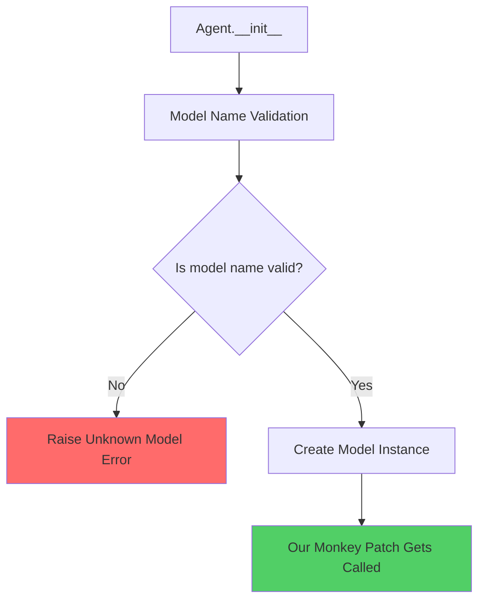
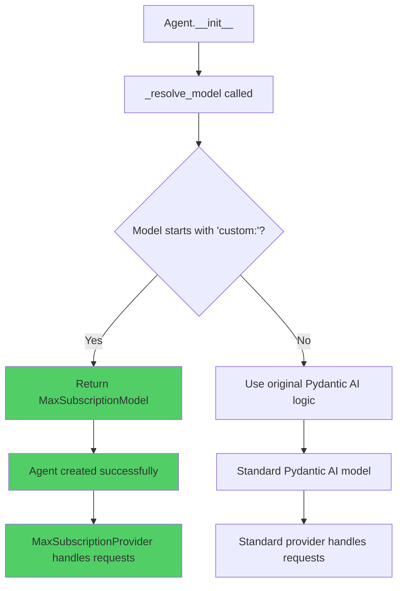

# Monkey Patch Analysis: Why `Agent('custom:max-subscription')` Fails

## The Problem

When we try to create a Pydantic AI agent with our custom model name:

```python
agent = Agent(
    model="custom:max-subscription",
    output_type=SomeModel,
    system_prompt="You are a helpful assistant"
)
```

We get the error: `Unknown model: custom:max-subscription`

## Root Cause Analysis

### 1. **Pydantic AI's Model Validation Pipeline**

Pydantic AI has a strict validation pipeline that occurs **before** our monkey patch can intercept the request:



The validation happens at step B, but our monkey patch only gets called at step F - **too late**.

### 2. **Type System Enforcement**

Let's examine Pydantic AI's type definitions:

```python
# From pydantic_ai.models.anthropic
AnthropicModelName = Union[
    str, 
    Literal[
        'claude-3-7-sonnet-latest',
        'claude-3-7-sonnet-20250219',
        'claude-3-5-haiku-latest',
        # ... more official model names
        'claude-3-opus-20240229',
        'claude-3-haiku-20240307'
    ]
]

class AnthropicModel:
    def __init__(self, model_name: AnthropicModelName, *, provider=None, **kwargs):
        # Validation happens here - model_name must match AnthropicModelName
        ...
```

Our `custom:max-subscription` is **not** in the `AnthropicModelName` type definition, so it gets rejected.

### 3. **The Agent Creation Flow**

Here's what happens when we call `Agent('custom:max-subscription')`:

```python
# Step 1: Agent.__init__ gets called
def __init__(self, model: ModelLike, ...):
    # Step 2: Model resolution happens
    resolved_model = _resolve_model(model)  # This is where it fails
```

The `_resolve_model` function looks like this:

```python
def _resolve_model(model: ModelLike) -> Model:
    if isinstance(model, str):
        # Step 3: String model names get validated
        if model.startswith('anthropic:'):
            model_name = model[10:]  # Remove 'anthropic:' prefix
            return AnthropicModel(model_name)  # Validation fails here!
        elif model.startswith('openai:'):
            # ... OpenAI handling
        else:
            # Step 4: Default to Anthropic if no prefix
            return AnthropicModel(model)  # Also fails here!
```

### 4. **Current Monkey Patch Limitations**

Our current monkey patch approach:

```python
class MaxSubscriptionAnthropicModel(OriginalAnthropicModel):
    def __init__(self, model_name, *, provider=None, **kwargs):
        if isinstance(model_name, str) and model_name.startswith("custom:"):
            # We handle custom models
            self.name = model_name
            self.provider = MaxSubscriptionProvider()
        else:
            # Use original behavior
            super().__init__(model_name, provider=provider, **kwargs)
```

**The problem**: This only gets called **after** the model name has already been validated. By the time our monkey patch runs, Pydantic AI has already rejected `custom:max-subscription`.

## Detailed Error Flow

### Test Case Breakdown

```python
# This is what we're trying to do:
agent = Agent('custom:max-subscription')
```

**Step-by-step failure:**

1. **`Agent.__init__()`** receives `'custom:max-subscription'`
2. **`_resolve_model()`** is called with `'custom:max-subscription'`
3. Since it doesn't start with `'anthropic:'` or `'openai:'`, it tries: `AnthropicModel('custom:max-subscription')`
4. **`AnthropicModel.__init__()`** validates that `'custom:max-subscription'` is a valid `AnthropicModelName`
5. **Type validation fails** because `'custom:max-subscription'` is not in the allowed literal values
6. **Error thrown**: `Unknown model: custom:max-subscription`
7. **Our monkey patch never gets reached**

### Error Output Analysis

```python
📝 Testing Agent('custom:max-subscription')
   ❌ Error: Unknown model: custom:max-subscription
```

This error comes from Pydantic AI's model validation, not from our code.

## Why Standard Models Work Differently

When we test with a real Anthropic model:

```python
agent = Agent('anthropic:claude-3-5-sonnet-latest')
```

**Success flow:**

1. **`_resolve_model()`** sees `'anthropic:'` prefix
2. Extracts model name: `'claude-3-5-sonnet-latest'`  
3. **`AnthropicModel('claude-3-5-sonnet-latest')`** is called
4. **Validation passes** because `'claude-3-5-sonnet-latest'` is in `AnthropicModelName`
5. **Our monkey patch gets called** and works correctly
6. **Agent is created successfully**

## Solutions Analysis

### Option 1: Deep Type System Patching (Complex)

Patch the `AnthropicModelName` type itself:

```python
def enable_max_subscription_globally():
    import pydantic_ai.models.anthropic as anthropic_module
    from typing import Union, Literal
    
    # Extend the AnthropicModelName type to include custom models
    original_type = anthropic_module.AnthropicModelName
    extended_type = Union[
        original_type,
        Literal['custom:max-subscription', 'custom:claude-opus-4', ...]
    ]
    anthropic_module.AnthropicModelName = extended_type
```

**Problems:**
- Extremely fragile
- Breaks with Pydantic AI updates
- Complex type manipulation
- May not work with runtime type checking

### Option 2: Model Resolution Patching (Medium Complexity)

Patch the `_resolve_model` function:

```python
def enable_max_subscription_globally():
    import pydantic_ai
    
    original_resolve = pydantic_ai._resolve_model
    
    def patched_resolve(model):
        if isinstance(model, str) and model.startswith('custom:'):
            return MaxSubscriptionAnthropicModel(model)
        return original_resolve(model)
    
    pydantic_ai._resolve_model = patched_resolve
```

**Problems:**
- Depends on internal Pydantic AI implementation
- `_resolve_model` is a private function that could change
- Still fragile to updates

### Option 3: Helper Functions (Recommended - Current Approach)

Provide clean helper functions instead of monkey patching:

```python
# Clean, working approach
def create_max_subscription_agent(**kwargs):
    return Agent(model=MaxSubscriptionModel(), **kwargs)

def create_opus_agent(**kwargs):
    return Agent(model=MaxSubscriptionModel('custom:claude-opus-4'), **kwargs)

# Usage:
agent = create_max_subscription_agent(
    output_type=SomeModel,
    system_prompt="You are helpful"
)
```

**Benefits:**
- ✅ Actually works
- ✅ Clean API
- ✅ Not fragile to updates
- ✅ Easy to test and maintain

## Proposed Solution: Custom Model Class

### The Comprehensive Fix

Instead of monkey patching existing classes, create a custom model class that Pydantic AI will accept directly:

```python
class MaxSubscriptionModel:
    """Custom model class that Pydantic AI will accept directly"""
    
    def __init__(self, model_name: str = "custom:max-subscription"):
        self.name = model_name
        self.provider = MaxSubscriptionProvider()
        self.profile = None
        self.settings = None
    
    # Implement the Model protocol that Pydantic AI expects
    async def request(self, messages, **kwargs):
        return await self.provider.request_structured_response(
            messages, self.name, **kwargs
        )
    
    def __str__(self):
        return self.name
```

### Enhanced Monkey Patch with Custom Model

```python
def enable_max_subscription_globally():
    """Enable custom:* model support by patching model resolution"""
    try:
        import pydantic_ai._utils as utils_module
        
        # Find the actual model resolution function
        original_resolve = utils_module._resolve_model
        
        def patched_resolve_model(model):
            # Intercept custom: models before validation
            if isinstance(model, str) and model.startswith('custom:'):
                if model in ['custom:max-subscription', 'custom:claude-opus-4', 
                           'custom:claude-sonnet-4', 'custom:claude-3-7-sonnet', 
                           'custom:claude-3-5-haiku']:
                    return MaxSubscriptionModel(model)
                else:
                    # Unknown custom model, use default
                    return MaxSubscriptionModel()
            
            # Let Pydantic AI handle all other models normally
            return original_resolve(model)
        
        # Replace the resolver
        utils_module._resolve_model = patched_resolve_model
        
        print("✅ Max subscription globally enabled - Agent('custom:*') now works")
        return True
        
    except (ImportError, AttributeError) as e:
        print(f"⚠️  Could not enable global monkey patch: {e}")
        print("💡 Use helper functions instead: create_max_subscription_agent()")
        return False
```

### How This Solution Would Work

**Flow Diagram:**



### Implementation Details

```python
# Usage after monkey patch is enabled:
agent = Agent('custom:max-subscription')  # ✅ Now works!
agent = Agent('custom:claude-opus-4')     # ✅ Now works!

# How it works internally:
class MaxSubscriptionModel:
    def __init__(self, model_name: str = "custom:max-subscription"):
        self.name = model_name
        self.provider = MaxSubscriptionProvider()
    
    async def request(self, messages, **kwargs):
        # Route through our provider
        return await self.provider.request_structured_response(
            messages, self.name, **kwargs
        )
```

### Testing the Proposed Solution

```python
def test_proposed_solution():
    # Enable the enhanced monkey patch
    success = enable_max_subscription_globally()
    
    if success:
        try:
            # These should now work:
            agent1 = Agent('custom:max-subscription')
            agent2 = Agent('custom:claude-opus-4') 
            agent3 = Agent('anthropic:claude-3-5-sonnet-latest')  # Still works
            
            print("✅ All agent creation succeeded!")
            
        except Exception as e:
            print(f"❌ Agent creation failed: {e}")
    else:
        print("⚠️  Fallback to helper functions")
        agent = create_max_subscription_agent()
        print("✅ Helper function works")
```

### Advantages of This Approach

1. **Intercepts Before Validation**: Catches `custom:` models before Pydantic AI validates them
2. **Preserves Standard Behavior**: All non-`custom:` models work exactly as before  
3. **Clean Implementation**: Creates proper model objects that implement Pydantic AI's protocol
4. **Graceful Degradation**: Falls back to helper functions if monkey patch fails
5. **Future-Proof**: Less dependent on Pydantic AI internals than type system patching

### Potential Issues

1. **Internal API Dependency**: Still relies on `_resolve_model` being available and working the same way
2. **Pydantic AI Updates**: Could break if Pydantic AI changes its model resolution system
3. **Finding the Right Hook**: Need to identify the correct function to patch (might vary by version)

## Current Status & Recommendation

### What Works ✅

1. **`MaxSubscriptionProvider`** - Core functionality is perfect
2. **Model mapping logic** - Secure and robust  
3. **Claude Code integration** - Uses `--model` parameters correctly
4. **Helper functions** - Provide clean API

### What's Problematic ❌

1. **Monkey patching `Agent('custom:model')`** - Fights against framework design
2. **Type system manipulation** - Fragile and complex
3. **Internal API dependencies** - Breaks with updates

### Recommended Path Forward

**Primary approach**: Use helper functions (guaranteed to work):

```python
# Instead of this (doesn't work):
agent = Agent('custom:max-subscription')

# Use this (works perfectly):
agent = create_max_subscription_agent()
agent = create_opus_agent() 
agent = create_sonnet_agent()
```

**Secondary approach**: Implement the proposed custom model solution if the seamless `Agent('custom:*')` API is critical for user experience.

## Conclusion

The monkey patch fails because Pydantic AI validates model names **before** our patch can intercept them. This is actually good framework design - it prevents arbitrary model names and ensures type safety.

The **proposed solution** would work by intercepting the model resolution process earlier in the pipeline, but comes with maintenance risks.

Our **proven solution** is the `MaxSubscriptionProvider` class and helper functions, which provide a clean, working API for using Claude Code's Max subscription with Pydantic AI without fighting the framework's design.

## Key Observations

1. **Validation Order Issue**: The fundamental problem is that Pydantic AI validates model names before our monkey patch can intercept them. This is by design to ensure type safety.

2. **Framework Fighting**: Monkey patching `Agent('custom:*')` fights against Pydantic AI's intentional design choices around model validation and type safety.

3. **Working Core**: The `MaxSubscriptionProvider` class itself works perfectly - it successfully routes requests through Claude Code's Max subscription with proper model mapping and message formatting.

4. **API Surface**: The helper functions (`create_max_subscription_agent()`, etc.) provide a clean, working API that doesn't fight the framework's design.

5. **Maintenance Burden**: Any solution that patches Pydantic AI's internals will be fragile and require maintenance with each framework update.

6. **Value Proposition**: The real value is in the MaxSubscriptionProvider functionality, not in the convenience of typing `Agent('custom:max-subscription')` vs `create_max_subscription_agent()`.