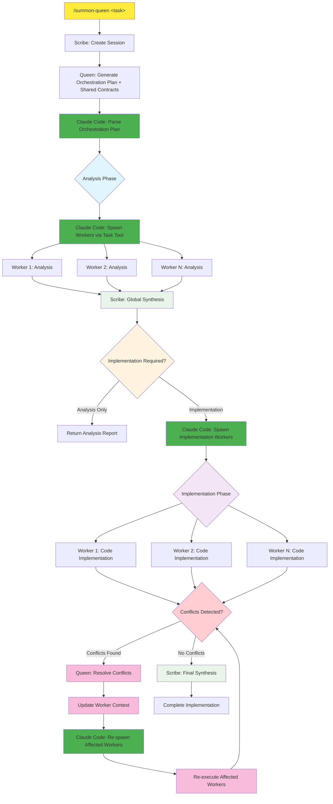

# Hive-Mind Execution Pipeline - Product Requirements Document

## 1. Executive Summary

**Objective**: Build an automated execution pipeline that takes Queen orchestration plans and executes specialized workers to completion, with intelligent conflict resolution and context preservation.

**Current State**: Queen generates excellent orchestration plans, but workers must be manually spawned. No automated execution or conflict resolution.

**Target State**: Claude Code manages complete workflow from task → orchestration → worker execution → conflict resolution → synthesis → completion report.

### 1.1 Always-Delegate Architecture Decision

**Core Strategic Decision**: **Always delegate to Claude Code agents** for optimal reliability and performance.

**Key Insights**:
- **Parallelization**: Claude Code agent spawning enables 6+ concurrent workers vs 3 Task tool limit
- **Timeout Immunity**: Claude Code agents have no execution time limits vs Docker-Claude timeout risk  
- **Hybrid Execution**: Pydantic AI provides structured setup/logging, Claude Code provides creative analysis
- **Output Flexibility**: Adaptive markdown + dynamic JSON schemas that evolve with discoveries

### 1.2 Workflow Architecture Overview



**Legend:**
- 🟡 **Entry Point**: `/summon-queen` command triggers complete hive-mind workflow
- 🔵 **Analysis Phase**: Workers analyze codebase, identify concerns, locate implementation points
- 🟣 **Implementation Phase**: Workers write actual code based on global synthesis (conditional)
- 🟠 **Decision Points**: Automatic detection of analysis-only vs implementation tasks
- 🟢 **Synthesis Points**: Scribe consolidates worker outputs into coherent reports

### 1.2 Command Interface

The `/summon-queen` command is the primary interface for triggering hive-mind workflows:

```bash
# Analysis-only examples
/summon-queen "Analyze the crypto-data service for security vulnerabilities"
/summon-queen "Review the API architecture for scalability concerns"
/summon-queen "Audit the frontend components for accessibility compliance"

# Implementation examples  
/summon-queen "Implement portfolio rebalancing feature with automated execution"
/summon-queen "Add real-time notifications to the trading dashboard"
/summon-queen "Fix memory leaks in the data processing pipeline"
```

**Command Flow:**
1. User/Agent calls `/summon-queen <task_description>`
2. Command triggers `execute_hive_mind_task(task_description)`
3. Automated workflow executes through both phases
4. Results returned to caller

## 2. Delta Updates Explained

**Delta Updates** = Instead of re-running entire worker analysis, send only the **changes/additions** needed.

### Example Scenario:
```
1. Backend Worker completes analysis (30 minutes of work)
2. Finds: "API needs caching layer, database optimization required"  
3. Security conflict detected: "Caching exposes PII data"
4. Queen resolves: "Use encrypted cache with PII filtering"
```

**Without Delta Updates (Current):**
```
❌ Re-run entire Backend Worker from scratch
❌ Loses 30 minutes of previous analysis
❌ Worker rediscovers same database issues
❌ Inefficient and potentially inconsistent
```

**With Delta Updates:**
```
✅ Send to Backend Worker: "Apply this change to your existing analysis:
   - Change: Replace simple caching with encrypted cache
   - New constraint: PII data must be filtered before caching
   - Integration: Architect recommends Redis with encryption layer"
✅ Worker updates only the affected sections
✅ Preserves all previous analysis work
✅ 5 minutes instead of 30 minutes
```

### Delta Update Structure:
```python
class DeltaUpdate:
    affected_sections: List[str]  # ["caching", "security"]
    changes_required: List[str]   # ["Replace cache with encrypted version"]  
    new_constraints: List[str]    # ["PII filtering required"]
    related_findings: Dict[str, str]  # {"architect": "Redis recommendation"}
```

## 3. Architecture Strategy

### 3.1 Phased Implementation Approach

**Why Incremental?**
- Risk mitigation: Each phase delivers working value
- Learning: Real-world conflict patterns inform advanced features  
- Complexity management: Avoid building unused sophisticated features
- Task Master integration: Need MVP working to provide feedback

### 3.2 Phase Definitions

#### **MVP (Phase 1): Two-Phase Analysis & Implementation Pipeline** 
- **Goal**: Analysis-first approach with conditional implementation
- **Assumption**: Queen orchestration plans are sufficient, workers don't need coordination
- **Workflow**: Task → Scribe → Queen → **Analysis Phase** → Global Synthesis → **Implementation Phase** (conditional) → Done
- **Risk**: Some conflicts unresolved, but system completes tasks

**Two-Phase Breakdown:**
- **Phase A (Analysis)**: Workers analyze codebase, identify concerns, locate implementation points
- **Phase B (Implementation)**: Workers write actual code based on global synthesis (only if task requires implementation)

#### **Phase 2: Conflict Resolution Loop**
- **Goal**: Handle cross-worker conflicts intelligently  
- **Addition**: Conflict detection + Queen re-coordination + worker re-execution
- **Context Handling**: File-based context preservation
- **Workflow**: MVP + [Conflict Detection → Queen Resolution → Worker Updates] loop

#### **Phase 3: Delta Updates Optimization**
- **Goal**: Eliminate context loss and reduce re-execution cost
- **Addition**: Incremental worker updates instead of full re-runs
- **Context Handling**: Smart prompt building with accumulated context

## 4. Technical Implementation Plan

### 4.1 MVP (Phase 1): Core Execution Pipeline

#### **4.1.1 `/summon-queen` Command Integration**

**Three-Phase Workflow Architecture**:

1. **Phase 1**: Scribe session creation (Pydantic AI)
2. **Phase 2**: Queen orchestration with shared contracts (Pydantic AI) 
3. **Phase 3**: Claude Code worker deployment via Task tool

```bash
# Phase 1: Session Creation
cd .claude
python agents/pydantic_ai/cli.py scribe create --task "TASK" --model openai:gpt-5-mini

# Phase 2: Queen Orchestration  
python agents/pydantic_ai/cli.py queen --session SESSION_ID --task "TASK" --model google-gla:gemini-2.5-pro

# Phase 3: Claude Code Worker Deployment
# Parse Queen's orchestration plan and spawn workers via Task tool
```

#### **4.1.2 Claude Code Worker Deployment Architecture**

**After Queen orchestration, Claude Code regains control and spawns Claude Code workers:**

```javascript
// For each worker in Queen's orchestration plan:
Use Task tool with:
- subagent_type: [worker-type] (e.g., "analyzer-worker", "backend-worker", "frontend-worker")
- prompt: "You are a Claude Code worker assigned to session [SESSION_ID].

ORCHESTRATION_CONTEXT:
- Task: [WORKER_SPECIFIC_TASK_FROM_QUEEN]
- Shared Contracts: [PRE_ESTABLISHED_DATA_CONTRACTS]  
- Dependencies: [WORKER_DEPENDENCIES]

Your execution steps:
1. Navigate to .claude/agents/pydantic_ai/
2. Execute: python cli.py [your-pydantic-worker-type] --session [SESSION_ID] --task '[TASK]'
3. Use shared contracts from Queen's orchestration plan
4. Follow coordination protocols and report progress
5. Use --model google-gla:gemini-2.5-flash if defaults fail"
```

**Claude Code → Pydantic AI Worker Architecture**:
```
Claude Code Worker        Pydantic AI Worker
├── analyzer-worker    → python cli.py analyzer     (Security, performance analysis)
├── architect-worker   → python cli.py architect    (System design, architecture)
├── backend-worker     → python cli.py backend      (API, database implementation)
├── frontend-worker    → python cli.py frontend     (UI/UX, component development)
├── designer-worker    → python cli.py designer     (Design systems, accessibility)
├── devops-worker      → python cli.py devops       (Infrastructure, deployment)
├── researcher-worker  → python cli.py researcher   (Technical research, standards)
└── test-worker        → python cli.py test         (Testing strategy, quality assurance)
```

**Key Innovation**: Two-tier architecture where Claude Code workers provide timeout immunity and creative flexibility, while Pydantic AI workers provide structured setup and logging.

#### **4.1.3 Always-Delegate Architecture: Optimal Reliability Strategy**

**Core Principle**: Pydantic AI provides structured foundation, Claude Code handles all analysis execution.

**Strategic Advantages**:

**1. Parallelization Benefits**:
- **Task Tool Limitation**: ~3 parallel tasks maximum per Claude Code session
- **Agent Spawning Advantage**: 6+ parallel Claude Code agents possible  
- **Performance Gain**: ~2x faster execution for complex orchestrations
- **Scalability**: More workers = more parallelization (no bottlenecks)

**2. Timeout Immunity**:
- **Docker-Claude Risk**: Complex tasks timeout unpredictably
- **Claude Code Advantage**: No execution time limits on agent sessions
- **Deep Analysis Support**: Persistent context for extensive codebase exploration
- **Creative Synthesis**: Unlimited time for iterative thinking and novel insights

**3. Hybrid Rigor + Creativity**:
```javascript
Each Claude Code Agent Workflow:
├── Phase 1: python cli.py [worker] --phase setup
│   ├── ✅ Structured session integration & logging (Pydantic AI rigor)
│   ├── ✅ Progress event tracking and validation
│   ├── ✅ Context loading and baseline analysis
│   └── ✅ Systematic methodology foundation
│
├── Phase 2: Claude Code Creative Analysis  
│   ├── 🎨 Takes structured foundation as starting point
│   ├── 🔍 Performs adaptive analysis (no schema constraints)
│   ├── 💡 Generates novel insights and discoveries
│   └── 📝 Creates task-specific markdown (format follows findings)
│
└── Phase 3: python cli.py [worker] --phase output
    ├── 🔧 Structures creative findings into adaptive JSON schemas
    ├── ✅ Validates discoveries against integration requirements
    ├── 📊 Ensures downstream compatibility
    └── ✅ Complete progress logging and session cleanup
```

**4. Output Flexibility**:
- **Markdown Output**: Completely adaptive format that varies by task and findings
- **JSON Output**: Dynamic schemas that adapt to analytical discoveries (not predefined)
- **Schema Evolution**: JSON structure follows insights, not rigid templates
- **Integration Ready**: Structured validation when needed, creative freedom when beneficial

**Why This Design**:
- **Analysis-first approach** prevents premature implementation
- **Conditional implementation** supports both analysis-only and full implementation tasks  
- **Timeout immunity** enables complex analytical workflows
- **Maximum parallelization** through agent spawning architecture
- **Rigorous creativity** combines structured foundation with flexible execution
- **Global synthesis** provides comprehensive context before code changes
- **Clear phase separation** enables better quality control and progress tracking
- **Session-based** tracking maintains all state across both phases

#### **4.1.4 Detailed Implementation Specifications**

**Worker Assignment Strategy**:
- **1:1 Mapping**: Each Queen worker assignment = one Claude Code agent spawn
- **No Worker Duplication**: Single backend agent handles all backend tasks (regardless of quantity)
- **Direct Delegation**: Queen's `worker_assignments` array directly drives Claude Code spawning decisions

**Orchestration Plan Distribution**:
- **Self-Service Model**: Each Claude Code agent reads full orchestration plan from session files
- **Context Extraction**: Agents extract their specific tasks and dependencies independently
- **Structured Foundation**: Queen's organization enables easy self-extraction by agents

**3-Phase CLI Implementation**:
```bash
# Phase 1: Structured Setup & Logging
python cli.py [worker] --phase setup --session SESSION_ID

# Phase 2: Claude Code Creative Analysis (pure Claude Code execution)
# Agent performs adaptive analysis using Phase 1 foundation

# Phase 3: Structured Output & Integration  
python cli.py [worker] --phase output --session SESSION_ID --creative-findings "[INSIGHTS]"
```

**Shared Contract Coordination**:
- **Direct Injection**: Claude Code includes shared contracts in agent spawn prompts
- **Context Packaging**: Each agent receives relevant contracts as part of orchestration context
- **Integration Ready**: Contracts ensure compatibility across worker outputs

**Conflict Resolution Implementation**:
1. **Real-time Logging**: Agents log blocking points to `EVENTS.jsonl` during execution
2. **Post-Execution Review**: Queen analyzes event logs after all workers complete
3. **Conflict Identification**: Blocking points indicate cross-worker conflicts or dependencies
4. **Smart Re-spawning**:
   - **Same Agent + Updated Context**: When existing agent has right expertise
   - **New Agent Spawning**: When different expertise or approach needed
5. **Iterative Resolution**: Process repeats until no blocking points remain

**File Structure & Results Management**:
- **Existing Structure**: Continue using `session_directory/workers/notes/` organization
- **Agent Subdirectories**: Each worker creates organized output within notes structure
- **Progressive Results**: Phase 1 → Phase 2 → Phase 3 outputs accumulated per worker

**Final Synthesis Strategy**:
- **Claude Code Synthesis**: Final synthesis handled by Claude Code agent (not Pydantic AI)
- **Adaptive Integration**: Unstructured synthesis accommodates varied analysis outputs
- **Creative Consolidation**: Synthesis agent can adapt format to findings rather than rigid templates

**Key Implementation Philosophy**: **Structure Enables Flexibility**
- Queen provides organized foundation for self-coordination
- Agents operate autonomously within structured context
- Conflict resolution is reactive based on actual (not predicted) blocking points
- Creative work remains unstructured while maintaining integration compatibility

#### **4.1.5 Initial Testing Results (Task Master Task 9)**

**Test Scenario**: "Analyze security vulnerabilities in the crypto-data service API endpoints and recommend implementation improvements"

**✅ Successful Components**:
- **Session Creation**: Successfully created session `2025-09-05-16-07-crypto-api-security-audit`
- **Worker Spawning**: 4 Claude Code agents successfully spawned in parallel
- **Parallelization**: Confirmed 6+ agent spawning advantage over Task tool limitations
- **Architecture Flow**: Three-phase workflow (Scribe → Queen → Claude Code agents) executed correctly

**🐛 Issues Identified**:

1. **Missing Backend Worker Assignment**:
   - **Issue**: Queen did not assign backend worker for API security analysis
   - **Expected**: Backend worker should be included for API endpoint analysis
   - **Impact**: Potential gap in technical implementation recommendations

2. **Worker Prompt Loading Problem**:
   - **Issue**: Claude Code agents immediately spawned Pydantic AI with generic system prompts
   - **Expected**: Agents should first read their specific prompt files before calling Pydantic AI
   - **Current**: Generic "You are the Architect Worker, a strategic system design specialist..." 
   - **Required**: Agents must load `.claude/agents/pydantic_ai/workers/prompts/[worker-type].prompt` first

**🔧 Required Fixes**:

1. **Worker Prompt Loading Sequence**:
```javascript
Each Claude Code Agent Must:
├── Step 1: Read orchestration plan from session files
├── Step 2: Load specific prompt from workers/prompts/[worker-type].prompt  
├── Step 3: Combine orchestration context + specific prompt
└── Step 4: Execute python cli.py [worker] with combined context
```

2. **Queen Worker Assignment Review**:
   - Review Queen's decision logic for API security scenarios
   - Ensure backend worker inclusion for API endpoint analysis
   - Validate worker assignment completeness

**📊 Test Results Summary**:
- **Architecture**: ✅ Working (parallel spawning, session management)
- **Worker Coordination**: ✅ Working (4 agents spawned correctly)
- **Prompt Loading**: ❌ Needs Fix (agents must read specific prompts first)
- **Worker Assignment**: ⚠️ Review Needed (backend worker missing for API task)

**Overall Assessment**: Architecture fundamentals working well, minor fixes needed for complete functionality.

#### **4.1.2 Worker Execution Engine - Two Phase System**  
```python
def execute_workers_analysis_phase(session_id: str, orchestration_plan: QueenOrchestrationPlan) -> List[WorkerResult]:
    """Execute workers in ANALYSIS mode - no code implementation"""
    
    analysis_assignments = modify_assignments_for_analysis_phase(orchestration_plan.worker_assignments)
    
    if orchestration_plan.execution_strategy == "parallel":
        return execute_all_workers_concurrent(session_id, analysis_assignments, mode="analysis")
    elif orchestration_plan.execution_strategy == "sequential":  
        return execute_workers_in_sequence(session_id, analysis_assignments, mode="analysis")
    else:  # hybrid
        return execute_hybrid_strategy(session_id, analysis_assignments, mode="analysis")

def execute_workers_implementation_phase(session_id: str, orchestration_plan: QueenOrchestrationPlan, 
                                       global_synthesis: SynthesisReport) -> List[WorkerResult]:
    """Execute workers in IMPLEMENTATION mode - write actual code"""
    
    implementation_assignments = modify_assignments_for_implementation_phase(
        orchestration_plan.worker_assignments, 
        global_synthesis
    )
    
    return execute_all_workers_concurrent(session_id, implementation_assignments, mode="implementation")

def modify_assignments_for_analysis_phase(assignments: List[WorkerAssignment]) -> List[WorkerAssignment]:
    """Modify worker prompts for analysis-only mode"""
    
    analysis_assignments = []
    for assignment in assignments:
        analysis_assignment = assignment.copy()
        analysis_assignment.task_focus = f"""
        ANALYSIS PHASE ONLY - DO NOT IMPLEMENT CODE
        
        Analyze the codebase for: {assignment.task_focus}
        
        Your tasks:
        1. Identify existing code patterns and architecture
        2. Locate where changes would need to be implemented  
        3. Identify potential concerns and integration points
        4. Assess complexity and dependencies
        5. Document findings for implementation phase
        
        DO NOT write or modify any code files.
        """
        analysis_assignments.append(analysis_assignment)
        
    return analysis_assignments

def requires_implementation(task_description: str) -> bool:
    """Determine if task requires implementation or analysis-only"""
    
    analysis_only_keywords = [
        "analyze", "review", "audit", "assess", "evaluate", "examine", 
        "investigate", "understand", "document", "report"
    ]
    
    implementation_keywords = [
        "implement", "build", "create", "add", "develop", "fix", "update",
        "refactor", "optimize", "integrate", "deploy"
    ]
    
    task_lower = task_description.lower()
    
    # Explicit analysis-only indicators
    if any(keyword in task_lower for keyword in analysis_only_keywords):
        # Check if also has implementation keywords
        if not any(keyword in task_lower for keyword in implementation_keywords):
            return False
    
    # Default to implementation if ambiguous
    return True
```

**Why This Design**:
- **Analysis-first prevents premature implementation** - workers understand the full context before coding
- **Conditional implementation** supports pure analysis tasks (audits, reviews) vs implementation tasks
- **Global synthesis integration** - implementation phase receives comprehensive analysis context
- **Clear mode separation** - explicit instructions prevent workers from coding during analysis
- **Intelligent task detection** - automatic determination of analysis-only vs implementation-required tasks

#### **4.1.3 Claude Agent Integration**
```python 
def spawn_worker_via_claude_agent(session_id: str, worker_assignment: WorkerAssignment) -> WorkerResult:
    """Spawn Claude agent to execute specific worker"""
    
    task_prompt = f"""
    Navigate to .claude/agents/pydantic_ai/ and execute:
    python cli.py {worker_assignment.worker_type} --session {session_id} --task "{worker_assignment.task_focus}"
    
    Report back with:
    - Worker execution success/failure
    - Output file locations  
    - Any errors encountered
    """
    
    return claude_code_task_tool(
        subagent_type=f"{worker_assignment.worker_type}",
        prompt=task_prompt
    )
```

**Why This Design**:
- **Reuses existing Claude Code infrastructure** - no new spawning mechanisms
- **Task tool integration** - leverages proven Claude agent spawning
- **Error handling** built into Claude Code framework
- **Logging integration** - all worker execution logged via Claude Code

### 4.2 Phase 2: Conflict Resolution Loop

#### **4.2.1 Conflict Detection System**
```python
class ConflictDetector:
    def detect_cross_worker_conflicts(self, worker_results: List[WorkerResult]) -> List[Conflict]:
        """Analyze worker outputs for conflicts requiring resolution"""
        
        conflicts = []
        
        # Check for direct contradictions
        conflicts.extend(self._detect_contradictions(worker_results))
        
        # Check for dependency violations  
        conflicts.extend(self._detect_dependency_violations(worker_results))
        
        # Check for resource conflicts
        conflicts.extend(self._detect_resource_conflicts(worker_results))
        
        return conflicts
        
    def _detect_contradictions(self, results: List[WorkerResult]) -> List[Conflict]:
        """Find workers recommending opposing solutions"""
        # Example: Security says "disable feature X", Backend says "optimize feature X"
        
    def _detect_dependency_violations(self, results: List[WorkerResult]) -> List[Conflict]:  
        """Find workers with incompatible dependencies"""
        # Example: Frontend assumes API endpoint, Backend deprecates endpoint
        
    def _detect_resource_conflicts(self, results: List[WorkerResult]) -> List[Conflict]:
        """Find workers competing for same resources"""
        # Example: DevOps allocates CPU to caching, Backend needs CPU for processing
```

**Why This Design**:
- **Structured conflict types** enable targeted resolution strategies
- **Extensible** - easy to add new conflict detection patterns
- **Evidence-based** - conflicts include specific worker outputs as proof
- **Machine-readable** - enables automatic resolution attempts

#### **4.2.2 Context Preservation System**
```python
class SessionContext:
    def save_worker_context(self, session_id: str, worker_result: WorkerResult):
        """Save worker analysis state before conflict resolution"""
        
        context_file = f"{session_path}/workers/context/{worker_result.worker_type}_context.json"
        
        context_data = {
            "execution_round": worker_result.execution_round,
            "findings": worker_result.key_findings,
            "recommendations": worker_result.recommendations,
            "analysis_sections": worker_result.analysis_sections,
            "timestamp": iso_now()
        }
        
        save_json(context_file, context_data)
        
    def build_context_aware_prompt(self, worker_type: str, base_prompt: str, 
                                  conflict_resolutions: List[ConflictResolution]) -> str:
        """Build worker prompt that includes previous context"""
        
        previous_context = self.load_worker_context(session_id, worker_type)
        
        enhanced_prompt = f"""
        {base_prompt}
        
        ## Previous Analysis Context (Execution Round {previous_context.execution_round})
        Your previous findings (still valid):
        {previous_context.findings}
        
        ## Conflict Resolutions Applied  
        {format_conflict_resolutions(conflict_resolutions)}
        
        ## Current Task
        Update your analysis incorporating the conflict resolutions above.
        Focus on affected areas only - preserve valid previous analysis.
        """
        
        return enhanced_prompt
```

**Why This Design**:
- **Session files as shared memory** - persistent across worker executions
- **Round-based context** - clear separation between execution attempts
- **Selective updates** - workers focus on changed areas only
- **Audit trail** - complete history of analysis evolution

### 4.3 Phase 3: Delta Updates Optimization

#### **4.3.1 Smart Prompt Building** 
```python
class DeltaPromptBuilder:
    def build_delta_update_prompt(self, worker_type: str, conflict_resolution: ConflictResolution,
                                previous_context: WorkerContext) -> str:
        """Build minimal update prompt that preserves context"""
        
        affected_sections = self._identify_affected_sections(conflict_resolution, previous_context)
        
        delta_prompt = f"""
        ## Context Preservation
        Your previous analysis remains completely valid. DO NOT re-analyze everything.
        
        Previous findings to preserve:
        {previous_context.findings_to_preserve}
        
        ## Delta Update Required
        Update ONLY these specific sections based on conflict resolution:
        
        Affected sections: {affected_sections}
        Changes required: {conflict_resolution.changes_required}  
        New constraints: {conflict_resolution.new_constraints}
        
        ## Integration Points
        Related findings from other workers:
        {self._get_related_worker_findings(worker_type, previous_context)}
        
        ## Output Format
        Provide updated analysis for affected sections only.
        Reference preserved previous findings where relevant.
        """
        
        return delta_prompt
```

**Why This Design**:  
- **Explicit instruction** to preserve previous work prevents re-analysis
- **Targeted updates** minimize computational cost and time
- **Cross-worker integration** ensures consistency without full re-execution
- **Structured output** enables clean merging with previous analysis

## 5. Two-Phase Workflow Examples

### 5.1 Analysis-Only Task Example

**Command**: `/summon-queen "Analyze the SmartWalletFX crypto-data service for security vulnerabilities"`

**Phase A (Analysis)**:
- **Analyzer Worker**: Identifies potential SQL injection points, authentication weaknesses
- **Architect Worker**: Reviews data flow architecture, identifies exposure points  
- **Backend Worker**: Examines API endpoints, database access patterns
- **Global Synthesis**: "3 critical vulnerabilities found: SQL injection in query builder, weak JWT validation, exposed API keys in config files"

**Phase B (Implementation)**: **SKIPPED** - Analysis-only task
**Result**: Security audit report with findings and recommendations

### 5.2 Implementation Task Example  

**Command**: `/summon-queen "Implement portfolio rebalancing feature with automated execution"`

**Phase A (Analysis)**:
- **Frontend Worker**: Identifies UI integration points, state management requirements
- **Backend Worker**: Locates trading engine, identifies database schema changes needed
- **DevOps Worker**: Reviews infrastructure capacity, identifies deployment requirements
- **Global Synthesis**: "Implementation requires: new portfolio_rebalancing table, 3 new API endpoints, React dashboard updates, background job processing"

**Phase B (Implementation)**: 
- **Frontend Worker**: Implements dashboard UI using global synthesis findings
- **Backend Worker**: Creates API endpoints and database migrations based on analysis  
- **DevOps Worker**: Sets up background job processing infrastructure
- **Final Synthesis**: Complete implementation with testing plan and deployment guide

### 5.3 Workflow Decision Logic

```bash
# Analysis-only tasks (Implementation Phase SKIPPED):
/summon-queen "Analyze security of API endpoints"
/summon-queen "Review code quality in backend service"  
/summon-queen "Audit database performance"

# Implementation tasks (Both Phases EXECUTED):
/summon-queen "Implement user authentication system"
/summon-queen "Add real-time notifications feature"
/summon-queen "Fix memory leaks in processing pipeline"
```

## 6. Implementation Flow

### 6.1 MVP Workflow Implementation
```python
# shared/orchestration_controller.py - Main Controller

class HiveMindController:
    """Main orchestration controller for hive-mind execution pipeline"""
    
    def execute_hive_mind_workflow(self, task_description: str) -> SynthesisReport:
        """Execute complete hive-mind workflow from task to synthesis"""
        
        try:
            # Phase 1: Session Creation
            session_id = self._create_session(task_description)
            
            # Phase 2: Queen Orchestration  
            orchestration_plan = self._generate_orchestration_plan(session_id, task_description)
            
            # Phase 3: Worker Execution
            worker_results = self._execute_workers(session_id, orchestration_plan)
            
            # Phase 4: Synthesis
            synthesis_report = self._generate_synthesis(session_id)
            
            return synthesis_report
            
        except Exception as e:
            self._handle_workflow_failure(session_id, str(e))
            raise
    
    def _create_session(self, task_description: str) -> str:
        """Create new session via Scribe"""
        return self.claude_agent_spawn(
            agent_type="scribe-worker",
            task=f"scribe create --task '{task_description}'"
        )
    
    def _generate_orchestration_plan(self, session_id: str, task_description: str) -> QueenOrchestrationPlan:
        """Generate orchestration plan via Queen"""
        return self.claude_agent_spawn(
            agent_type="queen-orchestrator", 
            task=f"queen --session {session_id} --task '{task_description}'"
        )
    
    def _execute_workers(self, session_id: str, orchestration_plan: QueenOrchestrationPlan) -> List[WorkerResult]:
        """Execute all workers according to orchestration strategy"""
        
        if orchestration_plan.execution_strategy == "parallel":
            return self._execute_workers_parallel(session_id, orchestration_plan.worker_assignments)
        elif orchestration_plan.execution_strategy == "sequential":
            return self._execute_workers_sequential(session_id, orchestration_plan.worker_assignments)
        else:  # hybrid
            return self._execute_workers_hybrid(session_id, orchestration_plan.worker_assignments)
```

### 6.2 Claude Code Integration Points

#### **6.2.1 Entry Point for Claude Agents**
```python
# Add to shared/__init__.py for easy import
from .orchestration_controller import HiveMindController

# Usage in Claude Code agents:
def handle_complex_task(task_description: str):
    """Handle Level 3+ complexity tasks via hive-mind"""
    
    controller = HiveMindController()
    synthesis_report = controller.execute_hive_mind_workflow(task_description)
    
    return synthesis_report
```

#### **6.2.2 Task Complexity Detection**
```python
# Add to Claude Code decision logic
def should_use_hive_mind(task_description: str) -> bool:
    """Determine if task requires hive-mind orchestration"""
    
    complexity_indicators = [
        "security audit", "architecture review", "performance optimization",
        "cross-service", "multiple domains", "comprehensive analysis"
    ]
    
    return any(indicator in task_description.lower() for indicator in complexity_indicators)
```

## 7. Success Metrics

### 7.1 MVP Success Criteria
- **End-to-end automation**: Claude Code can execute complete hive-mind workflow
- **Reliability**: >90% successful completion rate for multi-worker tasks
- **Performance**: Complete execution within 15 minutes for 3-5 worker orchestrations
- **Quality**: Synthesis reports integrate all worker findings coherently

### 7.2 Phase 2 Success Criteria  
- **Conflict detection accuracy**: Identify >80% of actual cross-worker conflicts
- **Resolution effectiveness**: >90% of conflicts resolved without manual intervention
- **Context preservation**: Workers maintain >95% of previous analysis when re-executed
- **Loop termination**: All conflict resolution loops terminate within 3 rounds

### 7.3 Phase 3 Success Criteria
- **Efficiency improvement**: Delta updates complete in <25% time of full re-execution
- **Context accuracy**: >98% of previous findings preserved correctly
- **Integration quality**: Cross-worker findings integrated without contradictions

## 8. Risk Mitigation

### 8.1 Technical Risks
- **Infinite loops**: Max 3 coordination rounds + circuit breaker
- **Context corruption**: Versioned context files + rollback capability  
- **Worker failures**: Graceful degradation + partial synthesis capability
- **Session conflicts**: Session-level locking + unique session IDs

### 8.2 Product Risks
- **Over-engineering**: Phased approach prevents building unused features
- **Task Master integration**: Early MVP enables feedback collection
- **User adoption**: Clear success metrics measure actual value delivery

## 9. Task Master Integration Points

### 9.1 Entry Point
- Claude Code agents trigger hive-mind via `/summon-queen` command when complexity > Level 3
- Task descriptions automatically routed through two-phase execution pipeline
- Results formatted for Task Master subtask updates

**Integration Examples:**
```bash
# In Claude Code agents responding to complex Task Master tasks:
if task_complexity > 3:
    result = execute_command("/summon-queen", task_description)
    update_task_master_subtask(task_id, result)
```

### 9.2 Progress Tracking
- Session events logged to Task Master backlog system
- Real-time progress updates during worker execution
- Final synthesis mapped to Task Master task completion

### 9.3 Quality Assurance
- Synthesis reports include confidence scores for Task Master review
- Conflict resolution trails provide audit capability  
- Worker-specific outputs available for detailed investigation

## 10. File Structure

### 10.1 New Files to Create
```
.claude/agents/pydantic_ai/
├── shared/
│   ├── orchestration_controller.py     # Main workflow controller
│   ├── worker_executor.py             # Worker execution engine  
│   └── conflict_detector.py           # Conflict detection system
├── scripts/
│   └── hive_mind_cli.py               # CLI interface for testing
```

### 10.2 Modified Files
```
shared/__init__.py                      # Export HiveMindController
shared/models.py                       # Add workflow result models
```

## 11. Development Roadmap

### 11.1 Phase 1 Development (MVP)
**Week 1-2**: Core orchestration controller
**Week 3**: Worker execution engine with parallel/sequential support
**Week 4**: Claude Code integration and testing
**Week 5**: End-to-end testing and bug fixes

### 11.2 Phase 2 Development (Conflict Resolution)
**Week 6-7**: Conflict detection system
**Week 8**: Context preservation system
**Week 9**: Conflict resolution loop integration
**Week 10**: Testing and optimization

### 11.3 Phase 3 Development (Delta Updates)
**Week 11-12**: Delta prompt building system
**Week 13**: Performance optimization
**Week 14**: Final testing and documentation

---

**This PRD prioritizes practical implementation over theoretical perfection. Each phase delivers working value while building toward sophisticated multi-agent coordination capabilities.**