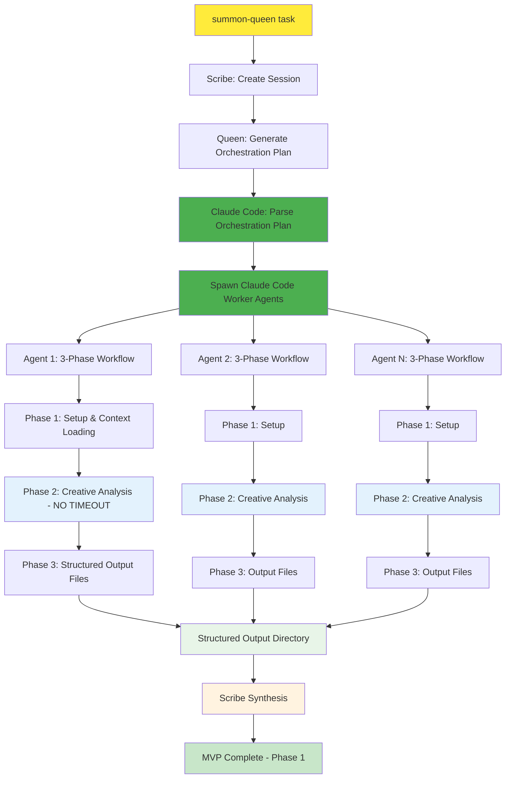
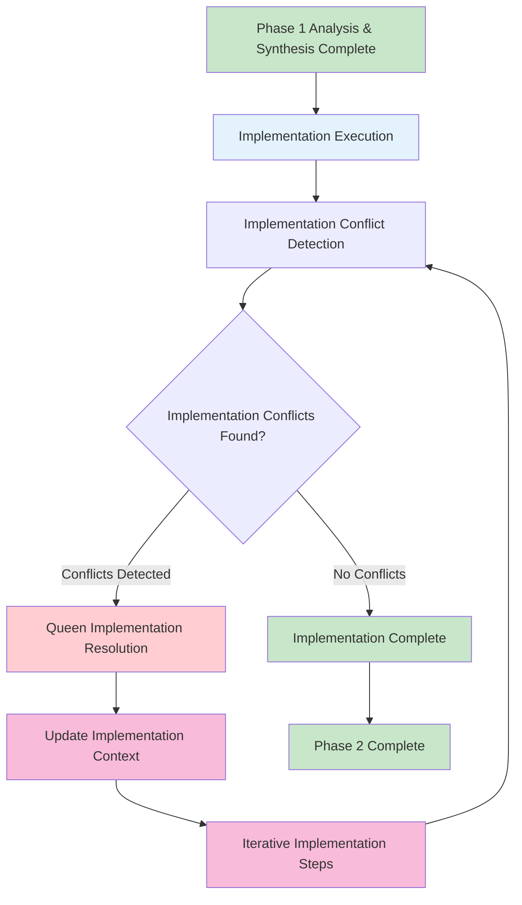

# Hive-Mind Execution Pipeline - Product Requirements Document

## 1. Executive Summary

**Objective**: Complete the automated execution pipeline by implementing structured workflows for Worker Agents with timeout immunity and standardized outputs.

**Current State**: 
- ✅ Scribe and Queen are fully functional and structured
- ✅ `/summon-queen` command works properly - initializes Scribe and spawns workers correctly
- ❌ Worker Agents (8 workers) have no structured workflow - behavior is unstructured
- ❌ No standardized output files from workers (prevents Scribe synthesis testing)
- ✅ Claude Code agents have timeout immunity (confirmed)

**Target State**: End-to-end structured workflow where Claude Code agents execute 3-phase worker processes (setup → creative analysis → output) with standardized file outputs and timeout immunity.

### 1.1 Core Problem: Worker Agent Structure Gap

**Current Working Components**:
- ✅ **Scribe**: Structured session creation and synthesis
- ✅ **Queen**: Structured orchestration with worker assignments
- ✅ **Basic CLI**: `python cli.py [worker] --session --task` executes

**Critical Gap**: Worker Agents Have No Structure
- **Problem 1**: Workers have no standardized workflow (setup → analysis → output)
- **Problem 2**: No control over worker behavior - they do "anything"
- **Problem 3**: No structured output files preventing Scribe synthesis testing
- **Problem 4**: Cannot test end-to-end workflow without structured outputs

**Solution Architecture**:
- **Timeout Immunity**: Claude Code agents confirmed to have no execution time limits
- **Task Tool Integration**: Use Claude Code's Task tool to spawn worker agents  
- **3-Phase Structure**: Each worker follows setup → creative analysis → structured output
- **Standardized Outputs**: Predictable file formats enabling Scribe synthesis testing

### 1.2 Simplified Architecture (MVP Implementation)



**Key Simplifications**:
- 🟡 **Entry Point**: `/summon-queen` (already working)  
- 🔵 **Session & Orchestration**: Scribe + Queen (already working)
- 🟢 **NEW: Claude Code Worker Spawning**: Parse Queen plan → spawn agents
- 🔵 **NEW: 3-Phase Worker Structure**: Each worker follows structured workflow
- 🟢 **NEW: Structured Outputs**: Standardized files enable Scribe synthesis
- 🟠 **NEW: Scribe Synthesis**: Final synthesis report using structured worker outputs

## 2. Current System State - What Already Works

### 2.1 Existing Functionalities (DO NOT RE-IMPLEMENT)

**✅ FULLY WORKING - No Changes Needed**:

1. **`/summon-queen` Command Interface**:
   - Command exists and works correctly
   - Properly invokes Scribe for session creation
   - Successfully triggers Queen orchestration
   - Correctly spawns Claude Code worker agents

2. **Scribe Agent (Session Management)**:
   - Creates sessions with proper directory structure
   - Generates session files in `Docs/hive-mind/sessions/{session_id}/`
   - Creates `SESSION.md`, `EVENTS.jsonl`, `DEBUG.jsonl`, `BACKLOG.jsonl`
   - Session creation workflow is complete and functional

3. **Queen Agent (Orchestration)**:
   - Generates orchestration plans correctly
   - Creates worker assignments and shared contracts
   - Coordinates multi-worker task distribution
   - Orchestration logic is complete and functional

4. **Claude Code Agent Spawning**:
   - Claude Code correctly invokes the appropriate workers
   - Worker spawning mechanism works properly
   - Can successfully launch multiple concurrent workers
   - Agent communication infrastructure is functional

5. **Session Directory Structure**:
   - `Docs/hive-mind/sessions/{session_id}/` structure exists
   - Sub-folders and basic files are created correctly
   - Event logging system (`EVENTS.jsonl`, `DEBUG.jsonl`) works
   - File system integration is complete

### 2.2 The ONLY Gap - Worker Behavior Control

**❌ WHAT NEEDS TO BE IMPLEMENTED**:

**Single Problem**: Worker agents have unstructured behavior
- Workers execute but don't follow standardized 3-phase workflow
- Workers don't generate standardized output files
- Workers behavior is uncontrolled - they do "anything"
- This prevents Scribe synthesis testing (cannot parse unstructured outputs)

**❌ WHAT IS MISSING**:
- 3-phase workflow structure for the 8 worker agents  
- Standardized output file formats from workers
- Structured worker outputs that enable Scribe synthesis

## 3. What Actually Needs to Be Implemented

### 3.1 3-Phase Worker Structure (Core Requirement)

Each existing worker agent (8 files in `.claude/agents/`) must follow this exact workflow:

**Phase 1: Invoke Pydantic AI Agent**
```bash
# Context loading and Pydantic AI delegation
1. Read session context from: Docs/hive-mind/sessions/{session_id}/workers/orchestration/orchestration_plan.json
2. Read worker-specific prompt from: Docs/hive-mind/sessions/{session_id}/workers/prompts/{worker_type}_prompt.txt
3. Navigate to .claude/agents/pydantic_ai/
4. Execute: python cli.py {worker_type} --session {session_id} --task "{prompt_content}"
5. Let Pydantic AI complete framework-enforced analysis
```

**Phase 2: Claude Code Creative Analysis**
```bash  
# Claude Code takes control for extended analysis
- Perform additional creative analysis beyond Pydantic AI capabilities
- Use Claude Code's unlimited analysis time and broader context
- Explore codebase thoroughly and identify implementation points
- Generate enhanced insights and recommendations
```

**Phase 3: Delegate Back to Pydantic AI for Structured Output** (Only 2 Files)
```bash
# Pass combined analysis back to Pydantic AI for structured output generation
1. Prepare combined analysis prompt with Claude Code findings
2. Execute: python cli.py {worker_type} --session {session_id} --task "{combined_analysis}"
3. Pydantic AI generates output files:
   - workers/notes/{worker_type}_notes.md (creative, no template)
   - workers/json/{worker_type}_output.json (structured, based on notes)
```

### 3.2 Standardized Output Structure

**Current Session Directory Structure** (Already exists after Queen orchestration):
```
Docs/hive-mind/sessions/{session_id}/
└── workers/
    ├── json/                        # Location for {worker_type}_output.json files
    ├── notes/                       # Location for {worker_type}_notes.md files
    ├── orchestration/               # Contains orchestration_plan.json from Queen
    └── prompts/                     # Contains worker-specific prompts
```

**Required Output Files per Worker** (2 Files, created by Pydantic AI agents):
```
workers/notes/{worker_type}_notes.md     # Creative analysis, findings, recommendations (no template)
workers/json/{worker_type}_output.json   # Structured data based on notes (no template)
```

**Example for Backend Worker**:
```
backend_notes.md     → "API security analysis, database optimization recommendations, implementation roadmap"
backend_output.json  → {
  "findings": {"vulnerabilities": [...], "optimizations": [...]},
  "context": {"session_id": "...", "execution_time": "...", "status": "complete"},
  "roadmap": ["Step 1: Fix SQL injection", "Step 2: Add caching layer"]
}
```

## 4. Three-Phase Implementation Roadmap

### 4.1 Phase 1: MVP - Structured Worker Execution (Current Focus)

**Goal**: Complete the basic structured workflow with standardized outputs

**Why Start Here**:
- Enable Scribe synthesis testing by providing structured worker outputs
- Focus on core 3-phase structure before adding conflict resolution complexity  
- Validate end-to-end workflow from `/summon-queen` to synthesis
- Build foundation for future conflict resolution features (Phase 2)

**Phase 1 Workflow**:
```
/summon-queen → Scribe → Queen → Claude Code Worker Spawning → 3-Phase Execution → Structured Outputs → Scribe Synthesis → DONE
```

**Phase 1 Success Criteria**:
- All 8 worker types execute 3-phase workflow consistently
- Standardized output files generated for every worker  
- Scribe synthesis testing enabled with structured worker outputs
- End-to-end workflow completes from `/summon-queen` to synthesis

### 4.2 Phase 2: Analysis Implementation + Intelligent Conflict Resolution

**Goal**: Implement the analysis from Phase 1 and handle cross-worker conflicts during implementation

**What Gets Added in Phase 2**:
After Phase 1 analysis and synthesis is complete, Phase 2 adds:
- **Implementation Execution**: Implement the files modifications and features identified in Phase 1 analysis
- **Implementation Conflict Detection**: Analyze conflicts that arise during actual implementation 
- **Queen-Based Resolution**: Use Queen to resolve implementation conflicts and update coordination strategies  
- **Context Preservation**: Maintain worker analysis state during implementation and conflict resolution cycles
- **Iterative Implementation**: Re-execute implementation steps with updated context and constraints

**Phase 2 Workflow Enhancement**:
```
Phase 1 Analysis & Synthesis → Implementation Execution → Implementation Conflict Detection → Queen Resolution → Context Updates → Iterative Implementation → Final Implementation Complete
```

**Implementation Conflict Resolution Examples**:
- **File Modification Conflicts**: Security worker wants to modify auth.py, Backend worker also modifying auth.py → Queen coordinates sequential or merged modifications
- **Implementation Dependencies**: Frontend implementation requires API endpoint that Backend implementation deprecates → Queen coordinates implementation order and API evolution
- **Resource Implementation Conflicts**: DevOps implementation allocates memory that Backend implementation also needs → Queen balances resource allocation during implementation

**Phase 2 Architecture**:


### 4.3 Phase 3: Delta Updates & Optimization  

**Goal**: Eliminate context loss and minimize re-execution costs

**What Gets Added in Phase 3**:
- **Delta Update System**: Send only changes/additions instead of full re-execution
- **Smart Context Preservation**: Maintain 98%+ of previous analysis when updating
- **Incremental Prompt Building**: Build minimal update prompts that preserve context
- **Performance Optimization**: Reduce conflict resolution time significantly

**Delta Updates Explained**:
Instead of re-running entire worker analysis, send only the **changes/additions** needed.

**Example Scenario**:
```
1. Backend Worker completes analysis (30 minutes of work)
2. Finds: "API needs caching layer, database optimization required"  
3. Security conflict detected: "Caching exposes PII data"
4. Queen resolves: "Use encrypted cache with PII filtering"
```

**Without Delta Updates (Phase 2)**:
```
❌ Re-run entire Backend Worker from scratch
❌ Loses 30 minutes of previous analysis
❌ Worker rediscovers same database issues
❌ Inefficient and potentially inconsistent
```

**With Delta Updates (Phase 3)**:
```
✅ Send to Backend Worker: "Apply this change to your existing analysis:
   - Change: Replace simple caching with encrypted cache
   - New constraint: PII data must be filtered before caching
   - Integration: Architect recommends Redis with encryption layer"
✅ Worker updates only the affected sections
✅ Preserves all previous analysis work
✅ 5 minutes instead of 30 minutes
```

**Phase 3 Success Criteria**:
- **Efficiency improvement**: Delta updates complete in <25% time of full re-execution
- **Context accuracy**: >98% of previous findings preserved correctly
- **Integration quality**: Cross-worker findings integrated without contradictions

## 3.4 Phase Implementation Strategy & Risk Management

### 3.4.1 Why Incremental Implementation?

**Risk Mitigation Strategy**:
- **Phase 1 Risk**: Building complex conflict resolution before basic structure works
- **Mitigation**: Validate core workflow first, ensure timeout immunity and output standardization
- **Learning Strategy**: Real-world usage patterns inform Phase 2 conflict detection algorithms

**Complexity Management**:
- **Phase 1**: 4 core components, ~2-3 weeks development
- **Phase 2**: 6 additional components, builds on Phase 1 foundation  
- **Phase 3**: 4 optimization components, builds on Phase 2 stability

**Task Master Integration Strategy**:
- **Phase 1**: Immediate value - structured worker execution for complex tasks
- **Phase 2**: Enhanced reliability - fewer failed multi-worker tasks
- **Phase 3**: Performance optimization - faster iteration cycles

### 3.4.2 Phase Dependencies & Integration Points

**Phase 1 → Phase 2 Dependencies**:
```
Phase 1 Outputs Required for Phase 2:
├── Standardized worker output formats
├── Session-based context files  
├── Event logging system (EVENTS.jsonl)
├── Worker execution metadata
└── Established 3-phase workflow patterns
```

**Phase 2 → Phase 3 Dependencies**:
```
Phase 2 Outputs Required for Phase 3:
├── Conflict detection algorithms
├── Context preservation patterns
├── Worker re-execution workflows
├── Queen resolution strategies
└── Performance bottleneck identification
```

**Cross-Phase Integration Patterns**:
- **File Structure Consistency**: All phases use same session directory structure
- **Event System Evolution**: Phase 1 events → Phase 2 conflict events → Phase 3 delta events
- **Worker Template Backward Compatibility**: Phase 3 workers still support Phase 1 basic execution

## 5. Phase 1 Technical Implementation Specification (MVP)

### 5.1 Core Components to Build (Phase 1)

#### **5.1.1 Worker Behavior Structure (ONLY Implementation Needed)**

**CRITICAL**: `/summon-queen`, Scribe, Queen, and worker spawning already work perfectly. 

**ONLY Problem**: Worker agents have unstructured behavior

**ONLY Solution Needed**: Modify existing 8 worker agents to follow 3-phase structured workflow

#### **5.1.2 3-Phase Worker Structure**

**Existing Agent Files to Modify** (8 files in `.claude/agents/`):
- `analyzer-worker.md`
- `architect-worker.md` 
- `backend-worker.md`
- `designer-worker.md`
- `devops-worker.md`
- `frontend-worker.md`
- `researcher-worker.md`
- `test-worker.md`

**3-Phase Workflow Structure** (to add to each existing agent file):

**Phase 1: Context Loading & Pydantic AI Invocation**
1. Read orchestration plan: `Docs/hive-mind/sessions/{session_id}/workers/orchestration/orchestration_plan.json`
2. Read worker prompt: `Docs/hive-mind/sessions/{session_id}/workers/prompts/{worker_type}_prompt.txt`
3. Navigate to `.claude/agents/pydantic_ai/`
4. Execute: `python cli.py {worker_type} --session {session_id} --task "{prompt_content}"`

**Phase 2: Claude Code Creative Analysis**
- Take control after Pydantic AI completes initial analysis
- Perform extended creative analysis beyond Pydantic AI capabilities
- Explore codebase thoroughly with unlimited analysis time

**Phase 3: Structured Output Generation**
1. Combine Claude Code analysis with Pydantic AI findings
2. Execute: `python cli.py {worker_type} --session {session_id} --task "{combined_analysis}"`
3. Pydantic AI creates files in session directory:
   - `workers/notes/{worker_type}_notes.md` (creative, no template)
   - `workers/json/{worker_type}_output.json` (structured, based on notes)

#### **5.1.3 No Integration Changes Required**

**CRITICAL**: NO modifications needed to `/summon-queen` command - it already works perfectly!

**Current Workflow (Fully Working)**:
1. `/summon-queen` invokes Scribe correctly ✅
2. Scribe creates session with proper structure ✅  
3. Queen generates orchestration plan with worker assignments ✅
4. Claude Code spawns appropriate worker agents ✅

**ONLY Missing**: Worker agents don't follow structured 3-phase workflow - that's the ONLY thing to implement

**Key Implementation Details**:
- **Session ID**: Available from Queen orchestration completion (passed to spawned workers)
- **Context Files**: Workers access `orchestration_plan.json` and their `{worker_type}_prompt.txt`
- **Output Creation**: Pydantic AI agents create the 2 output files (no templates needed - creative format)
- **Directory Structure**: `workers/` subdirectories already exist after Queen orchestration

## 6. Phase 2 Detailed Implementation Specification (Conflict Resolution)

### 6.1 Problem Statement for Phase 2

**Current Limitation of Phase 1**: Phase 1 provides analysis and synthesis but no implementation. After analysis is complete, implementation conflicts can arise during actual code changes.

**Real-World Implementation Conflict Examples**:
- **Security Worker** analysis recommends "modify auth.py to disable caching for sensitive endpoints"
- **Backend Worker** analysis simultaneously recommends "modify auth.py to implement aggressive caching"
- **Implementation Conflict**: Both workers need to modify the same file with conflicting changes
- **Result**: Implementation deadlock requiring resolution

**Phase 2 Goal**: Implement the analysis from Phase 1 and handle implementation conflicts that arise during actual code modifications.

### 6.2 Core Components Overview (Phase 2)

#### **6.2.1 Implementation Execution System**

**Purpose**: Execute the implementation steps identified in Phase 1 analysis and synthesis.

**How It Works**:
After Phase 1 analysis completion, the system coordinates implementation of identified changes across all workers.

#### **6.2.2 Implementation Conflict Detection System**

**Purpose**: Automatically identify when worker implementations conflict during actual code execution, preventing implementation deadlocks.

**How It Works**:
The system monitors implementation execution and detects four specific types of implementation conflicts:

**Type 1: File Modification Conflicts**
- **What It Detects**: Multiple workers attempting to modify the same file simultaneously
- **Real Example**: 
  - Security: "Modify auth.py lines 45-50 to remove session persistence"
  - Frontend: "Modify auth.py lines 48-52 to implement persistent user sessions"
- **Detection Method**: Track file modification targets and detect overlapping changes
- **Severity**: High (blocks implementation execution)

**Type 2: Implementation Dependency Violations**
- **What It Detects**: Worker implementation steps that create or break dependencies
- **Real Example**:
  - Frontend: "Implement WebSocket connection to `/api/realtime` in dashboard.js"  
  - Backend: "Remove `/api/realtime` endpoint from routes.py due to scaling issues"
- **Detection Method**: Track API endpoints, function calls, and imports being added/removed during implementation
- **Severity**: High (causes runtime failures during implementation)

**Type 3: Implementation Resource Conflicts** 
- **What It Detects**: Workers implementing changes that compete for the same system resources
- **Real Example**:
  - DevOps: "Implement Redis caching with 4GB memory allocation in docker-compose.yml"
  - Backend: "Implement heap size increase to 4GB in application.properties"  
  - Conflict: Total requirement exceeds available 6GB RAM
- **Detection Method**: Parse resource allocation changes during implementation and check for conflicts
- **Severity**: High (causes implementation failures)

**Type 4: Implementation Architecture Inconsistencies**
- **What It Detects**: Workers implementing conflicting architectural patterns
- **Real Example**:
  - Architect: "Implement service separation by creating user-service/ and auth-service/ directories"
  - DevOps: "Implement monolithic deployment by consolidating all services into single container"
- **Detection Method**: Monitor directory structure changes and deployment configuration implementations
- **Severity**: High (fundamental implementation conflicts)

**Output Format**: Each detected implementation conflict includes:
- Implementation conflict type and severity level
- Affected workers and specific implementation steps
- File modification conflicts and overlapping changes
- Suggested implementation resolution approach  
- Impact assessment on overall implementation timeline

#### **6.2.3 Queen-Powered Implementation Conflict Resolution Engine**

**Purpose**: Use the Queen agent to intelligently resolve detected implementation conflicts by coordinating file modifications and implementation order.

**How Queen Resolves Implementation Conflicts**:

**Resolution Strategy 1: Sequential Implementation Coordination**
- **When Used**: Multiple workers need to modify the same file
- **Example Conflict**: Security and Backend both modifying auth.py
- **Queen Resolution**: "Security implements session changes first (lines 45-50), then Backend implements caching (lines 51-60)"  
- **Result**: Both implementations completed without file conflicts

**Resolution Strategy 2: Implementation Merge Coordination**  
- **When Used**: Conflicting implementation approaches can be merged
- **Example Conflict**: Frontend implementing WebSocket while Backend removes endpoint
- **Queen Analysis**: Evaluates implementation dependencies and coordination requirements
- **Queen Resolution**: "Backend implements new WebSocket endpoint before Frontend connects to it"
- **Result**: Coordinated implementation order preventing runtime failures

**Resolution Strategy 3: Phased Implementation**
- **When Used**: Conflicts involve trade-offs between short-term and long-term solutions
- **Example Conflict**: Monolithic vs microservices architecture
- **Queen Resolution**: "Phase 1: Monolithic for rapid deployment, Phase 2: Gradual decomposition to microservices"
- **Result**: Practical implementation timeline that satisfies both approaches

**Resolution Strategy 4: Additional Worker Assignment**
- **When Used**: Conflicts reveal missing expertise or analysis
- **Example Conflict**: Frontend and Backend disagree on API design
- **Queen Resolution**: "Assign API Architect specialist to design optimal contract"  
- **Result**: New worker spawned with specific expertise to resolve the conflict

**Queen's Decision Process**:
1. **Context Analysis**: Review full session history and business requirements
2. **Stakeholder Impact Assessment**: Evaluate impact on users, developers, and operations
3. **Technical Feasibility Check**: Assess implementation complexity and risks
4. **Strategic Alignment**: Ensure resolution aligns with overall system goals
5. **Implementation Guidance**: Provide specific, actionable resolution steps

#### **5.2.3 Context Preservation System**

**Purpose**: Maintain all worker analysis state during conflict resolution cycles, preventing loss of valuable insights and avoiding duplicate work.

**Location**: `.claude/agents/pydantic_ai/shared/context_preservation.py`

**Why Context Preservation is Critical**:
- **Time Investment**: Workers may spend 20-30 minutes on deep analysis
- **Insight Value**: Discoveries about codebase architecture and issues must not be lost
- **Efficiency Goal**: Conflict resolution should take 5-10 minutes, not restart from zero

**What Gets Preserved**:

**Analysis State Preservation**:
- All identified code locations and file references
- Discovered patterns and architectural insights  
- Security vulnerabilities and performance bottlenecks found
- Integration points and dependency mappings
- Confidence scores and uncertainty areas

**Relationship Preservation**:
- Cross-worker references and shared findings
- Dependency chains identified by multiple workers
- Shared data contracts and API specifications
- Integration requirements and constraints

**Execution Metadata Preservation**:
- Time spent analyzing specific code sections
- Files examined and depth of analysis performed
- Insights generated and validation performed
- Worker-specific methodology and approach used

**How Context is Applied During Updates**:

**Selective Update Instructions**: When a worker needs re-execution due to conflict resolution, they receive:
- **Complete preserved context**: "Your previous 25-minute analysis identified these 12 security issues..."
- **Specific conflict updates**: "Only update your caching recommendation based on this Queen resolution..."
- **Integration requirements**: "Ensure your updated approach aligns with Backend Worker's database optimization..."
- **Preservation instructions**: "Do not re-analyze the authentication system - reference your previous findings..."

**Context File Structure**:
```
session_id/workers/context/
├── backend_context_round_1.json     # Initial analysis state
├── backend_context_round_2.json     # Post-conflict resolution state  
├── security_context_round_1.json    # Preserved security findings
└── integration_context.json         # Cross-worker shared findings
```

#### **5.2.4 Iterative Resolution Management System**

**Purpose**: Manage multiple rounds of conflict resolution while preventing infinite loops and ensuring convergence toward implementable solutions.

**Location**: `.claude/agents/pydantic_ai/shared/iterative_execution.py`

**Why Iterative Resolution is Needed**:
- **Cascade Effects**: Resolving one conflict may create new conflicts
- **Complex Dependencies**: Some conflicts only become apparent after initial resolutions
- **Refinement Process**: First resolution attempts may need adjustment based on implementation feasibility

**Iterative Process Flow**:

**Round 1: Initial Conflict Resolution**
- Detect all obvious conflicts between worker outputs
- Apply Queen resolutions to most critical conflicts first
- Re-execute affected workers with updated context
- Generate updated output files with resolved recommendations

**Round 2: Secondary Conflict Detection**
- Analyze updated outputs for new conflicts or cascade effects
- Identify any unresolved dependencies or integration issues  
- Apply refined Queen resolutions based on Round 1 learnings
- Focus on edge cases and implementation details

**Round 3: Final Validation and Edge Cases** 
- Final conflict sweep for any remaining inconsistencies
- Validate that all resolutions are implementable together
- Address any remaining technical feasibility concerns
- Generate final consolidated implementation guidance

**Circuit Breaker Mechanisms**:

**Maximum Rounds Limit**: 3 rounds maximum to prevent infinite loops
- **Reasoning**: 95% of conflicts should resolve in 1-2 rounds
- **Fallback**: If conflicts persist after 3 rounds, escalate to human review with detailed conflict analysis

**Convergence Detection**: System recognizes when conflicts are diminishing
- **Success Metric**: <5% of original conflicts remain unresolved
- **Early Termination**: Stop iteration if no new conflicts detected and existing conflicts are low-severity

**Quality Gates**: Each round must meet minimum quality thresholds
- **Context Preservation**: >90% of previous analysis preserved during updates
- **Resolution Consistency**: New resolutions don't contradict previous resolutions  
- **Implementation Feasibility**: All resolutions have clear implementation paths

**Monitoring and Reporting**:
- Track resolution time per round (target: <10 minutes per round)
- Monitor context preservation accuracy (target: >95%)
- Report conflict types and resolution strategies for system improvement
- Generate detailed resolution history for audit and learning

### 5.3 Phase 2 Integration and Testing Strategy

**End-to-End Conflict Resolution Workflow**:
1. **Phase 1 Completion**: All workers have generated their initial analysis and output files
2. **Conflict Scanning**: System automatically scans for the 4 types of conflicts described above
3. **Queen Resolution**: Conflicts are sent to Queen for strategic resolution with business context
4. **Selective Re-execution**: Only affected workers are re-run with preserved context and new constraints
5. **Validation**: System verifies that resolutions are implementable and don't create new conflicts
6. **Final Synthesis**: Consolidated implementation guidance is generated

**Success Metrics for Phase 2**:
- **Conflict Detection Accuracy**: >80% of real conflicts identified without false positives
- **Resolution Quality**: >90% of conflicts resolved without manual intervention
- **Context Preservation**: >95% of original analysis preserved during re-execution
- **Performance**: Complete conflict resolution cycle in <30 minutes for typical 3-5 worker scenarios
- **Convergence Rate**: >95% of conflicts resolved within 3 iterative rounds

## 6. Phase 3 Detailed Implementation Specification (Delta Updates & Optimization)

### 6.1 Problem Statement for Phase 3

**Current Limitation of Phase 2**: While Phase 2 successfully resolves conflicts, it still requires significant re-execution time (10-20 minutes per affected worker) even when changes are minimal.

**Real-World Efficiency Problem**:
- **Backend Worker** spends 25 minutes analyzing entire API architecture
- **Conflict Detected**: Caching strategy needs adjustment due to security requirements
- **Phase 2 Solution**: Re-run entire Backend Worker analysis (another 25 minutes)
- **Actual Need**: Only update the 2-3 sections related to caching (should take 3-5 minutes)

**Phase 3 Goal**: Implement intelligent delta updates that preserve 98%+ of previous analysis while making targeted updates in minimal time.

### 6.2 Core Components Overview (Phase 3)

#### **6.2.1 Intelligent Delta Update Generation System**

**Purpose**: Analyze conflict resolutions and generate minimal update instructions that preserve maximum context while addressing specific changes.

**Location**: `.claude/agents/pydantic_ai/shared/delta_updates.py`

**How Delta Updates Work**:

**Step 1: Semantic Impact Analysis**
The system analyzes the conflict resolution to understand exactly which parts of the previous analysis are affected:

**Example Conflict Resolution**: "Replace simple caching with encrypted caching + PII filtering"

**Impact Analysis Results**:
- **Affected Sections**: "API Performance Optimization", "Data Security Implementation"
- **Unaffected Sections**: "Database Schema Analysis", "Authentication System Review", "Error Handling Patterns"
- **Dependent Sections**: "Session Management" (references caching), "Audit Logging" (references data handling)

**Step 2: Context Preservation Mapping**
The system identifies exactly what previous analysis to preserve:

**Preserved Context (95% of original work)**:
- All database optimization recommendations (15 minutes of analysis)
- Complete authentication security audit (8 minutes of analysis)  
- Error handling and logging analysis (5 minutes of analysis)
- API endpoint documentation and validation (7 minutes of analysis)

**Update Requirements (5% of original work)**:
- Caching strategy implementation approach (2 sections)
- Data filtering and encryption requirements (1 section)
- Integration points with session management (dependency update)

**Step 3: Targeted Update Prompt Generation**
The system creates a highly specific prompt that tells the worker exactly what to preserve and what to update:

**Delta Prompt Structure**:
```
## Context Preservation Mode - CRITICAL

Your previous 25-minute analysis is FULLY PRESERVED except for specific updates below.

## PRESERVED ANALYSIS (DO NOT RE-ANALYZE):
- Database Optimization: [Specific findings from previous analysis]
- Authentication Security: [Specific findings from previous analysis]  
- Error Handling: [Specific findings from previous analysis]
- API Documentation: [Specific findings from previous analysis]

## TARGETED UPDATES REQUIRED (UPDATE ONLY THESE):

### Section 1: API Performance Optimization
Previous Finding: "Implement Redis caching for API responses"
Required Update: "Replace with encrypted Redis caching + automatic PII detection"
Integration Point: Must align with session management approach

### Section 2: Data Security Implementation  
Previous Finding: "Standard data validation on API inputs"
Required Update: "Add PII filtering layer before any caching operations"
Constraint: Must maintain API response time requirements

## OUTPUT REQUIREMENTS:
- Reference preserved findings as-is
- Provide updated analysis for ONLY the 2 sections above
- Maintain integration consistency with preserved sections
- Estimated update time: 3-5 minutes
```

#### **6.2.2 Smart Context Compression and Optimization**

**Purpose**: Optimize prompt efficiency by intelligently compressing preserved context while maintaining all critical information for accurate updates.

**Location**: `.claude/agents/pydantic_ai/shared/smart_context.py`

**Why Context Compression is Needed**:
- **Token Limitations**: Full previous analysis may exceed context window
- **Efficiency Goal**: Focus worker attention on relevant preserved context  
- **Quality Maintenance**: Ensure compressed context maintains update accuracy

**Compression Strategies**:

**Strategy 1: Hierarchical Summarization**
- **Executive Summary**: High-level overview of preserved analysis (200 tokens)
- **Critical Findings**: Key discoveries that might affect updates (500 tokens)
- **Reference Architecture**: System structure context for integration (300 tokens)
- **Detailed Context**: Full context for sections related to updates (remaining tokens)

**Strategy 2: Semantic Relevance Filtering**
The system analyzes which preserved findings are most relevant to the required updates:

**High Relevance** (Include full detail):
- Findings that directly interact with update sections
- Architecture decisions that constrain update approaches
- Performance or security requirements that affect updates

**Medium Relevance** (Include summary):
- Related system components that might be affected
- Dependencies that should be considered during updates
- Previous decisions that provide useful context

**Low Relevance** (Include reference only):
- Independent system analysis unrelated to updates
- Standalone recommendations with no integration points
- Complete analysis sections that won't be modified

**Strategy 3: Dynamic Context Window Management**
- **Target Token Budget**: 8,000 tokens for context (leaving room for response)
- **Priority Allocation**: Critical findings get guaranteed token allocation
- **Adaptive Compression**: Increase compression for lower-priority content as needed
- **Quality Threshold**: Maintain >95% context completeness for update-relevant information

#### **6.2.3 Delta Update Validation and Quality Assurance**

**Purpose**: Ensure that delta updates maintain analysis quality and properly preserve context while making required changes.

**Location**: `.claude/agents/pydantic_ai/shared/delta_validation.py`

**Validation Dimensions**:

**Context Preservation Accuracy**:
- **Measurement**: Compare preserved references in delta update to original analysis
- **Target**: >98% accuracy in preserved context references
- **Validation Method**: Semantic similarity analysis between original and referenced content
- **Failure Response**: If <95% accuracy, fall back to full re-execution

**Integration Consistency**:
- **Measurement**: Check that updated sections align with preserved sections
- **Target**: No contradictions between updated and preserved recommendations
- **Validation Method**: Cross-reference analysis for logical consistency
- **Failure Response**: Flag inconsistencies for Queen review and resolution

**Update Completeness**:
- **Measurement**: Verify that all required changes from conflict resolution are addressed
- **Target**: 100% of conflict resolution requirements implemented
- **Validation Method**: Compare delta update output against conflict resolution requirements
- **Failure Response**: Re-run delta update with enhanced conflict resolution context

**Time and Efficiency Gains**:
- **Measurement**: Track actual time savings compared to full re-execution
- **Target**: <25% of full re-execution time while maintaining >95% quality
- **Validation Method**: Compare delta update time and quality metrics to baseline
- **Improvement**: Use metrics to optimize delta generation for future updates

### 6.3 Phase 3 Performance and Efficiency Goals

**Dramatic Time Reduction Examples**:

**Scenario 1: Security Compliance Update**
- **Full Re-execution**: 20 minutes to re-analyze entire security posture
- **Delta Update**: 4 minutes to update compliance requirements in 3 affected sections
- **Time Savings**: 80% reduction while maintaining comprehensive security analysis

**Scenario 2: API Integration Change**
- **Full Re-execution**: 15 minutes to re-analyze complete API architecture
- **Delta Update**: 3 minutes to update specific endpoint requirements and data contracts
- **Time Savings**: 80% reduction while preserving all architectural insights

**Scenario 3: Performance Optimization Adjustment**
- **Full Re-execution**: 30 minutes to re-analyze complete system performance
- **Delta Update**: 6 minutes to adjust caching strategy and resource allocation
- **Time Savings**: 80% reduction while maintaining performance optimization analysis

**System-Wide Efficiency Impact**:
- **Phase 2 Conflict Resolution**: 10-20 minutes per affected worker
- **Phase 3 Delta Updates**: 3-5 minutes per affected worker  
- **Overall Improvement**: 5-7x faster conflict resolution cycles
- **Quality Maintenance**: >98% context preservation ensures no analysis quality loss

### 6.4 Phase 3 Integration and Testing Strategy

**Progressive Rollout Approach**:
1. **Pilot Testing**: Enable delta updates for low-risk, single-section changes
2. **Validation Phase**: Monitor preservation accuracy and time savings metrics
3. **Gradual Expansion**: Enable for more complex, multi-section updates
4. **Full Integration**: Replace Phase 2 full re-execution with Phase 3 delta updates

**Success Metrics for Phase 3**:
- **Time Efficiency**: <25% of Phase 2 re-execution time for equivalent updates
- **Context Preservation**: >98% accuracy in preserving non-affected analysis
- **Quality Maintenance**: No reduction in update quality compared to full re-execution
- **Integration Consistency**: Zero conflicts between updated and preserved sections
- **System Reliability**: >95% success rate for delta updates without fallback to full re-execution

## 7. Implementation Summary

### 7.1 What NOT to Touch (Already Working)

**DO NOT MODIFY - These work perfectly**:
1. `/summon-queen` command ✅
2. Scribe agent and session creation ✅
3. Queen agent and orchestration ✅  
4. Claude Code worker spawning ✅
5. Session directory structure ✅
6. Event logging system ✅

### 7.2 ONLY Required Implementation

**ONLY Modify These 8 Existing Files**:
- `analyzer-worker.md`
- `architect-worker.md`
- `backend-worker.md`  
- `designer-worker.md`
- `devops-worker.md`
- `frontend-worker.md`
- `researcher-worker.md`
- `test-worker.md`

**Add 3-Phase Structure to Each**:
1. **Phase 1**: Read context files → invoke Pydantic AI agent (`python cli.py {worker_type}`)
2. **Phase 2**: Claude Code takes control for creative analysis  
3. **Phase 3**: Combine findings → delegate back to Pydantic AI for output generation

**Implementation Instructions for Each Worker**:
- Modify prompts to ensure workers execute all 3 phases without deviation
- Workers must read `orchestration_plan.json` and `{worker_type}_prompt.txt` during Phase 1
- Output files created by Pydantic AI in `workers/notes/` and `workers/json/` directories
- No templates required - creative format based on task requirements

**Result**: Scribe synthesis testing automatically enabled - no other modifications needed

### 7.3 Integration Testing

**Test End-to-End Workflow** (Only to verify worker behavior changes):
```bash
/summon-queen "Analyze the crypto-data service for security vulnerabilities"
```

**Expected Results After Implementation**:
- Session created by Scribe ✅ (already works)
- Orchestration plan generated by Queen ✅ (already works)
- Claude Code workers spawned for each assignment ✅ (already works)
- **NEW**: Structured output files created by each worker (3-phase workflow)
- **NEW**: Scribe synthesis completes successfully using structured outputs

## 8. Phase 1 Success Criteria

- ✅ All 8 worker types execute structured 3-phase workflow
- ✅ Standardized output files generated consistently  
- ✅ Scribe synthesis testing enabled and working
- ✅ End-to-end workflow from `/summon-queen` to synthesis complete
- ✅ No changes to existing working components (`/summon-queen`, Scribe, Queen, spawning)

---

**This updated PRD focuses on Phase 1 MVP: structured worker execution with standardized outputs to enable Scribe synthesis testing. Phase 2 (conflict resolution) and Phase 3 (delta updates) are clearly defined for future implementation.**
