# 🗳️ Worker Conflict Resolution Protocol

System for resolving conflicts when multiple workers make contradictory technical decisions using majority voting (inspired by Claude-Flow).

## 🔄 Conflict Resolution Flow

```mermaid
graph TD
    A[🔍 Conflict Detected] --> B{Conflict Type?}
    
    B -->|Library Selection| C[📊 Queen Initiates Vote]
    B -->|Architecture Approach| C
    B -->|Implementation Strategy| C
    B -->|API Design| C
    B -->|Security Approach| C
    
    C --> D[📢 Send Vote Notification to Workers]
    D --> E[⏱️ Workers Have 55min to Vote]
    
    E --> F[🗳️ Workers Cast Votes]
    F --> G[👑 Queen Counts Votes]
    
    G --> H{Vote Result?}
    H -->|Clear Majority >50%| I[✅ Announce Resolution]
    H -->|Tie| J[⚖️ Service Architect Breaks Tie]
    H -->|<60% Participation| K[🔄 Extend Voting Period]
    
    J --> I
    K --> E
    
    I --> L[📝 Update Decision Records]
    L --> M[👷 Assign Implementation Lead]
    M --> N[📋 Update Archon Tasks]
    N --> O[✅ Continue Work]
    
    %% Exception Path
    H -->|No Clear Resolution| P[👑 Queen Executive Override]
    P --> L
    
    %% Styling
    classDef conflict fill:#ffebee
    classDef vote fill:#e3f2fd
    classDef resolution fill:#e8f5e8
    classDef action fill:#fff3e0
    
    class A,B conflict
    class C,D,E,F,G,H,J,K vote
    class I,P resolution
    class L,M,N,O action
```


## When Conflicts Occur

### Typical Conflict Scenarios
1. **Library Selection**: Two workers choose different libraries for same purpose
2. **Architecture Approach**: Different design patterns for same component
3. **Implementation Strategy**: Conflicting approaches to solve same problem
4. **API Design**: Different endpoint structures or data formats
5. **Security Approach**: Different authentication/authorization methods

## Conflict Detection

### Automatic Detection Triggers
Queen monitors EVENTS.jsonl for patterns indicating conflicts:

1. **Multiple Independent Decisions**: Same timestamp range, overlapping domain
2. **Explicit Escalation**: Worker calls for conflict resolution
3. **Blocking Dependencies**: Workers can't proceed due to contradictory decisions

### Conflict Detection Event
```json
{"timestamp": "2025-01-15T15:00:00Z", "type": "coordination", "event": "conflict_detected", "agent": "queen", "target": "all", "data": {"conflict_id": "auth-implementation-choice", "conflicting_decisions": [{"agent": "backend-worker", "decision": "JWT with express-jwt", "decision_id": "backend-001"}, {"agent": "analyzer-worker", "decision": "OAuth2 with Passport.js", "decision_id": "analyzer-003"}], "domain": "authentication", "impact": "blocks frontend and testing work"}}
```

## Voting System - Majority Rule

### Step 1: Queen Initiates Vote
When conflict detected, Queen sends voting event:

```json
{"timestamp": "2025-01-15T15:05:00Z", "type": "notification", "event": "conflict_vote_required", "agent": "queen", "target": "all", "data": {"conflict_id": "auth-implementation-choice", "description": "Choose authentication approach", "options": [{"id": "jwt-express", "title": "JWT with express-jwt library", "proposed_by": "backend-worker", "rationale": "Simpler implementation, faster development", "pros": ["Quick setup", "Lightweight", "Team familiarity"], "cons": ["Less enterprise features", "Manual refresh handling"]}, {"id": "oauth2-passport", "title": "OAuth2 with Passport.js", "proposed_by": "analyzer-worker", "rationale": "Better security, enterprise ready", "pros": ["Industry standard", "Built-in providers", "Better security"], "cons": ["More complex setup", "Learning curve"]}], "eligible_voters": ["backend-worker", "frontend-worker", "analyzer-worker", "service-architect", "test-worker"], "voting_deadline": "2025-01-15T16:00:00Z", "requires_majority": true}}
```

### Step 2: Workers Cast Votes
Each eligible worker responds with vote:

```json
{"timestamp": "2025-01-15T15:15:00Z", "type": "notification", "event": "conflict_vote_cast", "agent": "service-architect", "target": "queen", "data": {"conflict_id": "auth-implementation-choice", "vote": "oauth2-passport", "rationale": "Aligns with enterprise security requirements and future scalability needs", "confidence": "high"}}
```

```json
{"timestamp": "2025-01-15T15:18:00Z", "type": "notification", "event": "conflict_vote_cast", "agent": "frontend-worker", "target": "queen", "data": {"conflict_id": "auth-implementation-choice", "vote": "jwt-express", "rationale": "Frontend integration is simpler with JWT tokens", "confidence": "medium"}}
```

### Step 3: Vote Counting and Resolution
Queen tallies votes and announces result:

```json
{"timestamp": "2025-01-15T16:00:00Z", "type": "coordination", "event": "conflict_resolved", "agent": "queen", "target": "all", "data": {"conflict_id": "auth-implementation-choice", "resolution": "oauth2-passport", "vote_tally": {"oauth2-passport": 3, "jwt-express": 2}, "winning_margin": "majority", "voters": [{"agent": "backend-worker", "vote": "jwt-express"}, {"agent": "frontend-worker", "vote": "jwt-express"}, {"agent": "analyzer-worker", "vote": "oauth2-passport"}, {"agent": "service-architect", "vote": "oauth2-passport"}, {"agent": "test-worker", "vote": "oauth2-passport"}], "implementation_lead": "analyzer-worker", "next_actions": ["Update architecture docs", "Create implementation plan", "Update Archon tasks"]}}
```

## Voting Rules

### Eligible Voters
1. **Direct Stakeholders**: Workers whose work is affected by the decision
2. **Domain Experts**: Workers with expertise in the conflict area
3. **Quality Gatekeepers**: Analyzer, Service Architect (always included)

### Voting Power
- **Equal Weight**: Each eligible worker gets 1 vote
- **No Veto Power**: No single worker can override majority
- **Queen Abstains**: Queen coordinates but doesn't vote (maintains neutrality)

### Resolution Criteria
- **Simple Majority**: >50% of eligible voters
- **Tie Breaking**: Service Architect gets tie-breaking vote
- **Minimum Participation**: At least 60% of eligible voters must participate

## Implementation Process

### Step 1: Update Conflicting Decisions
Losing options are marked as superseded:
```json
{"timestamp": "2025-01-15T16:05:00Z", "type": "decision", "event": "decision_superseded", "agent": "backend-worker", "data": {"original_decision_id": "backend-001", "superseded_by": "conflict_resolution", "conflict_id": "auth-implementation-choice", "new_decision": "oauth2-passport", "status": "superseded"}}
```

### Step 2: Assign Implementation Lead
Winner of conflict becomes implementation lead:
```json
{"timestamp": "2025-01-15T16:10:00Z", "type": "coordination", "event": "implementation_assigned", "agent": "queen", "target": "analyzer-worker", "data": {"lead_role": "OAuth2 implementation", "conflict_resolution": "auth-implementation-choice", "supporting_workers": ["backend-worker", "frontend-worker"], "deliverables": ["Implementation plan", "Code structure", "Integration guides"]}}
```

### Step 3: Update Archon Tasks
Reflect resolution in Archon project tasks:
```
Use mcp__archon__manage_task to update relevant tasks with resolution details
Include conflict resolution outcome in task descriptions for audit trail
```

## Conflict Prevention

### Design Patterns for Conflict Avoidance

1. **Early Coordination**: Workers announce intended decisions before implementation
2. **Domain Boundaries**: Clear responsibility areas reduce overlap conflicts  
3. **Architecture Reviews**: Service Architect reviews major decisions early
4. **Research Synthesis**: Unified research reduces contradictory information

### Pre-Decision Announcement
```json
{"timestamp": "2025-01-15T14:00:00Z", "type": "notification", "event": "decision_intent", "agent": "backend-worker", "target": "all", "data": {"intended_decision": "Use JWT for authentication", "rationale": "Simple and fast implementation", "affected_domains": ["authentication", "api-security"], "feedback_window": "2 hours", "proceed_if_no_objection": true}}
```

## Escalation Beyond Voting

### When Voting Fails
- **No Clear Majority**: Multiple rounds or Queen makes executive decision
- **Technical Impossibility**: Architecture makes some options unfeasible
- **External Constraints**: Regulatory or business requirements override voting

### Executive Override
In exceptional cases, Queen can override vote:
```json
{"timestamp": "2025-01-15T16:30:00Z", "type": "coordination", "event": "executive_override", "agent": "queen", "target": "all", "data": {"conflict_id": "auth-implementation-choice", "override_decision": "jwt-express", "override_reason": "Client deadline requires fastest implementation", "vote_result_overridden": "oauth2-passport", "justification": "Business priority overrides technical preference"}}
```

## Conflict Resolution Metrics

### Track Resolution Effectiveness
- **Resolution Time**: Time from conflict detection to implementation start
- **Vote Participation**: Percentage of eligible voters who participated
- **Implementation Success**: Whether resolved decision worked as expected
- **Team Satisfaction**: Post-resolution feedback from workers

### Learning Integration
- **Pattern Analysis**: Common conflict types for prevention
- **Decision Quality**: Track success rate of majority vs minority choices
- **Process Improvement**: Refine voting rules based on outcomes

## Integration with Independent Decisions

### Enhanced Decision Documentation
Include conflict awareness in decision files:

```markdown
### Decision #5 - 2025-01-15T15:30:00Z
**Decision**: OAuth2 with Passport.js (Conflict Resolution Winner)
**Context**: Chosen via majority vote over JWT approach
**Conflict ID**: auth-implementation-choice
**Vote Tally**: 3-2 majority decision
**Implementation Lead**: analyzer-worker (original proposer)
**Dissenting Opinion**: backend-worker preferred JWT for simplicity
**Resolution Rationale**: Security and scalability concerns outweighed implementation speed
```

This system ensures technical conflicts are resolved democratically while maintaining implementation momentum and team cohesion.