# 🚀 Fast Worker Escalation Protocol

**Breaking Change**: Fast worker-to-worker coordination system with automatic escalation timeouts.

## 🔄 Worker Coordination Flow

```mermaid
graph TD
    A[🚧 Worker Blocked] --> B[📝 Log Blocker Event to EVENTS.jsonl]
    B --> C[⏰ Start Escalation Timer]
    
    C --> D{Target Worker Response?}
    D -->|Response within timeout| E[📨 Acknowledgment Received]
    D -->|No response| F[⚠️ Timeout Exceeded]
    
    E --> G[🔄 Coordination & Implementation]
    G --> H[✅ Blocker Resolved]
    
    F --> I[🚨 Auto-Escalate Event]
    I --> J{Escalation Chain?}
    J -->|Has escalation chain| K[👷 Escalate to Next Worker]
    J -->|No chain available| L[👑 Escalate to Queen]
    
    K --> M[🔄 Repeat Process]
    L --> N[👑 Queen Intervention]
    
    M --> D
    N --> O[🎯 Executive Decision]
    O --> H
    
    %% Timeout levels
    P[⏱️ Timeout Levels:<br/>Critical: 2min<br/>High: 5min<br/>Medium: 10min<br/>Low: 15min]
    C -.-> P
    
    %% Styling
    classDef blocked fill:#ffebee
    classDef timer fill:#fff3e0
    classDef response fill:#e8f5e8
    classDef escalation fill:#fce4ec
    classDef resolution fill:#e3f2fd
    
    class A,B blocked
    class C,P timer
    class E,G,H response
    class F,I,J,K,L,M escalation
    class N,O resolution
```


## Core Escalation System

### Priority-Based Timeouts
- **Critical**: 2 minutes (API specs, security issues, blocking dependencies)
- **High**: 5 minutes (implementation dependencies, cross-domain coordination)  
- **Medium**: 10 minutes (design decisions, architectural questions)
- **Low**: 15 minutes (nice-to-have clarifications, documentation)

### Event Types
- **blocker**: Worker needs something from another worker (starts escalation timer)
- **response**: Immediate acknowledgment (resets escalation timer)
- **coordination**: Information/implementation delivery (resolves blockers)
- **escalation**: Auto-triggered when timeouts exceeded
- **status**: Progress updates during implementation

## Worker Coordination Protocol

### Step 1: Send Blocker Event
When you need something from another worker:

```json
{
  "ts": "2025-01-15T10:00:00Z",
  "type": "blocker", 
  "agent": "frontend-worker",
  "target": "backend-worker",
  "priority": "critical",
  "event_id": "auth-api-spec-001",
  "context": "Need JWT payload structure to implement login form",
  "escalate_at": "2025-01-15T10:02:00Z",
  "blocking_tasks": ["implement-login-form", "setup-auth-state"],
  "required_info": "JWT token structure and validation rules"
}
```

**Add to EVENTS.jsonl**:
```
Edit("Docs/hive-mind/sessions/{session-id}/EVENTS.jsonl", 
     old_string="[last line]",
     new_string="[last line]\n{blocker event}")
```

### Step 2: Target Worker Response (< 30s)
**Immediate Acknowledgment Required**:

```json
{
  "ts": "2025-01-15T10:00:25Z",
  "type": "response",
  "agent": "backend-worker",
  "target": "frontend-worker", 
  "priority": "critical",
  "event_id": "auth-api-spec-001",
  "context": "Ack, providing JWT spec from documentation",
  "response_type": "ack",
  "eta": "2025-01-15T10:01:30Z",
  "references": ["auth-api-spec-001"]
}
```

### Step 3: Information/Implementation Delivery
**Quick Info (1-2 min)**:
```json
{
  "ts": "2025-01-15T10:01:15Z",
  "type": "coordination",
  "agent": "backend-worker",
  "target": "frontend-worker",
  "priority": "critical", 
  "event_id": "auth-api-spec-001",
  "context": "JWT payload structure provided",
  "delivery_type": "quick_info",
  "payload": {
    "jwt_structure": {
      "user_id": "UUID",
      "roles": "string[]",
      "exp": "timestamp"
    }
  },
  "resolves": ["auth-api-spec-001"]
}
```

**Implementation Required (3-8 min)**:
```json
{
  "ts": "2025-01-15T10:07:30Z",
  "type": "coordination",
  "agent": "backend-worker", 
  "target": "frontend-worker",
  "priority": "high",
  "event_id": "user-endpoints-002",
  "context": "User profile endpoints implementation complete",
  "delivery_type": "implementation",
  "deliverables": {
    "endpoints": ["/api/users/profile", "/api/users/update"],
    "documentation": "Updated in backend-notes.md section 3.2"
  },
  "resolves": ["user-endpoints-002"]
}
```

## Auto-Escalation System

### Escalation Triggers
When `escalate_at` timestamp is reached without response:

```json
{
  "ts": "2025-01-15T10:02:01Z",
  "type": "escalation",
  "agent": "system",
  "target": "service-architect",
  "priority": "critical",
  "event_id": "auth-api-spec-001",
  "context": "Auto-escalation: Backend worker timeout on critical API spec request",
  "escalated_from": "backend-worker",
  "original_blocker": "auth-api-spec-001", 
  "escalation_reason": "timeout_exceeded",
  "escalation_chain": ["backend-worker", "service-architect"]
}
```

### Escalation Chains
- **Backend Issues**: `backend-worker` → `service-architect` → `queen-orchestrator`
- **Frontend Issues**: `frontend-worker` → `designer-worker` → `service-architect` → `queen-orchestrator`  
- **Security Issues**: `any-worker` → `analyzer-worker` → `service-architect` → `queen-orchestrator`
- **Architecture Questions**: `any-worker` → `service-architect` → `queen-orchestrator`
- **Testing & DevOps**: `any-worker` → `test-worker` → `devops-worker` → `queen-orchestrator`

## Queen Monitoring Protocol

### Monitor for Auto-Escalations
```
Read("Docs/hive-mind/sessions/{session-id}/EVENTS.jsonl")

Filter for:
- type="escalation" (requires Queen intervention)
- type="blocker" AND escalate_at < current_time (missed escalations)
- type="blocker" AND resolved=false AND age > 10min (stuck blockers)
```

### Queen Coordination Response
```json
{
  "ts": "2025-01-15T10:05:00Z",
  "type": "coordination",
  "agent": "queen-orchestrator",
  "target": "service-architect", 
  "priority": "critical",
  "event_id": "queen-intervention-001",
  "context": "Queen intervention: Assign architect to resolve escalated auth question",
  "delivery_type": "task_assignment",
  "data": {
    "original_blocker": "auth-api-spec-001",
    "escalated_from": "backend-worker",
    "priority_override": "critical",
    "archon_task_id": "uuid-here"
  }
}
```

## 🧠 Event Processing & Filtering

### Event Monitoring Function
```python
def monitor_events(session_id, worker_type, last_check_timestamp=None):
    """Event filtering - workers only see relevant notifications"""
    import json
    from datetime import datetime, timedelta
    
    try:
        events_file = f"Docs/hive-mind/sessions/{session_id}/EVENTS.jsonl"
        raw_content = Read(events_file)
        
        if not raw_content:
            return {"relevant_events": [], "escalations": [], "status": "no_events"}
            
        all_events = []
        for line in raw_content.strip().split('\n'):
            if line.strip():
                try:
                    event = json.loads(line.strip())
                    all_events.append(event)
                except:
                    continue
                    
        # Filter for relevant events only
        relevant_events = []
        escalations = []
        cross_domain_insights = []
        
        for event in all_events:
            # Skip if too old (unless critical)
            if last_check_timestamp:
                event_time = datetime.fromisoformat(event['timestamp'].replace('Z', '+00:00'))
                last_check = datetime.fromisoformat(last_check_timestamp.replace('Z', '+00:00'))
                if event_time < last_check and event.get('priority') != 'critical':
                    continue
                    
            # Direct targets
            if event.get('target') == worker_type:
                relevant_events.append(event)
                
            # Escalations to my domain
            if (event.get('type') == 'escalation' and 
                should_handle_escalation(event, worker_type)):
                escalations.append(event)
                
            # Cross-domain insights (filtered by domain relevance)
            if (event.get('type') == 'coordination' and 
                is_domain_relevant(event, worker_type)):
                cross_domain_insights.append(event)
                
        return {
            "relevant_events": relevant_events,
            "escalations": escalations, 
            "cross_domain_insights": cross_domain_insights,
            "status": "processed",
            "total_filtered": len(all_events) - len(relevant_events) - len(escalations)
        }
        
    except Exception as e:
        return {"relevant_events": [], "escalations": [], "status": f"error: {e}"}

def should_handle_escalation(event, worker_type):
    """Determine if this worker should handle an escalation"""
    escalation_domains = {
        'service-architect': ['architecture', 'system_design', 'patterns', 'scalability'],
        'analyzer-worker': ['security', 'performance', 'vulnerability', 'audit'],
        'backend-worker': ['api', 'database', 'server', 'auth'],
        'frontend-worker': ['ui', 'ux', 'components', 'state'],
        'designer-worker': ['design', 'user_experience', 'accessibility'],
        'test-worker': ['testing', 'quality', 'validation'],
        'devops-worker': ['deployment', 'infrastructure', 'ci_cd'],
        'researcher-worker': ['research', 'documentation', 'best_practices']
    }
    
    event_context = event.get('context', '').lower()
    worker_domains = escalation_domains.get(worker_type, [])
    
    return any(domain in event_context for domain in worker_domains)
    
def is_domain_relevant(event, worker_type):
    """Check if cross-domain event provides relevant insights"""
    # Security insights relevant to all
    if 'security' in event.get('context', '').lower():
        return True
        
    # Architecture insights relevant to backend/frontend
    if ('architecture' in event.get('context', '').lower() and 
        worker_type in ['backend-worker', 'frontend-worker']):
        return True
        
    # Performance insights relevant to backend/analyzer
    if ('performance' in event.get('context', '').lower() and 
        worker_type in ['backend-worker', 'analyzer-worker']):
        return True
        
    return False
```

## Worker Behavior Requirements

### Response Pattern with Event Monitoring
1. **Event Monitoring** every 2-3 min using `monitor_events()`
2. **Instant acknowledgment** for critical events (< 30s) 
3. **Automatic escalation detection** - respond to relevant domain escalations
4. **Cross-domain insight integration** - learn from other workers' findings
5. **Progress updates** with dependency tracking
6. **Resolution with evidence** - link to deliverables and validation

### 🚀 Auto-Escalation System

**Automatic escalation detection:**
```python
def check_auto_escalations(session_id, current_time):
    """Detect and trigger auto-escalations for timeout events"""
    events = smart_monitor_events(session_id, 'system')['relevant_events']
    
    escalation_triggers = []
    
    for event in events:
        if event.get('type') == 'blocker':
            escalate_time = event.get('escalate_at')
            if escalate_time and escalate_time < current_time:
                # Check if already resolved
                resolved = any(e.get('resolves', []) for e in events 
                              if event['event_id'] in e.get('resolves', []))
                              
                if not resolved:
                    escalation_triggers.append({
                        'original_event': event,
                        'escalation_type': 'timeout_exceeded',
                        'target_worker': get_escalation_target(event)
                    })
                    
    return escalation_triggers

def get_escalation_target(blocker_event):
    """Determine who should handle escalated blocker"""
    escalation_chains = {
        'backend-worker': 'service-architect',
        'frontend-worker': 'designer-worker', 
        'analyzer-worker': 'service-architect',
        'designer-worker': 'service-architect',
        'test-worker': 'devops-worker',
        'devops-worker': 'service-architect',
        'researcher-worker': 'service-architect',
        'service-architect': 'queen-orchestrator'
    }
    
    blocker_agent = blocker_event.get('agent')
    return escalation_chains.get(blocker_agent, 'queen-orchestrator')
```

### 🎨 Reprioritization Protocol
**AI-assisted priority management:**
```python
def reprioritize_tasks(current_tasks, incoming_blocker):
    """Reprioritize based on dependencies and impact"""
    priority_scores = {
        'critical': 100,
        'high': 75,
        'medium': 50, 
        'low': 25
    }
    
    blocker_score = priority_scores.get(incoming_blocker.get('priority'), 50)
    
    # Analyze current task dependencies
    reprioritization = {
        'can_pause': [],
        'should_continue': [],
        'blocking_dependencies': []
    }
    
    for task in current_tasks:
        task_score = priority_scores.get(task.get('priority'), 50)
        
        # Check if task blocks others
        if task.get('blocking_others'):
            reprioritization['should_continue'].append(task)
        elif blocker_score > task_score + 20:  # Significant priority difference
            reprioritization['can_pause'].append(task)
        else:
            reprioritization['blocking_dependencies'].append(task)
            
    return reprioritization
```

### Cross-Domain Escalation
When you can't handle a request:
```json
{
  "ts": "2025-01-15T10:00:30Z",
  "type": "escalation",
  "agent": "backend-worker",
  "target": "designer-worker",
  "priority": "high", 
  "event_id": "ui-design-question-001",
  "context": "Escalating UX question to designer - outside backend domain",
  "escalated_from": "frontend-worker",
  "escalation_reason": "wrong_domain",
  "original_request": "Need user flow for multi-step form"
}
```

## File Management Rules

### EVENTS.jsonl Operations
- **Append Only**: Never overwrite, always append new events
- **Read Before Write**: Check current state before adding events
- **Event ID Uniqueness**: Use descriptive, unique identifiers  
- **Timestamp Precision**: ISO format with timezone
- **JSON Validation**: Ensure valid JSON for each line

### Integration with Session Files
- **Reference in Worker Notes**: Link event_ids in implementation notes
- **Update STATE.json**: Include coordination metrics and blocker counts
- **Archive Resolution**: Copy resolved coordination patterns to archive

## Best Practices

### 📊 Progress Aggregation for Queen

**Real-time session progress tracking:**
```python
def aggregate_session_progress(session_id):
    """Provide Queen with real-time coordination status"""
    events = Read(f"Docs/hive-mind/sessions/{session_id}/EVENTS.jsonl")
    
    progress = {
        'active_blockers': 0,
        'resolved_blockers': 0,
        'escalations_count': 0,
        'worker_activity': {},
        'coordination_efficiency': 0,
        'critical_issues': []
    }
    
    blocker_events = []
    resolution_events = []
    
    for line in events.strip().split('\n'):
        if not line.strip():
            continue
            
        event = json.loads(line)
        event_type = event.get('type')
        agent = event.get('agent')
        
        # Track worker activity
        if agent not in progress['worker_activity']:
            progress['worker_activity'][agent] = {'events': 0, 'last_activity': None}
            
        progress['worker_activity'][agent]['events'] += 1
        progress['worker_activity'][agent]['last_activity'] = event.get('timestamp')
        
        # Track coordination patterns
        if event_type == 'blocker':
            blocker_events.append(event)
            progress['active_blockers'] += 1
        elif event_type == 'coordination' and event.get('resolves'):
            resolution_events.append(event) 
            progress['resolved_blockers'] += len(event.get('resolves', []))
        elif event_type == 'escalation':
            progress['escalations_count'] += 1
            if event.get('priority') == 'critical':
                progress['critical_issues'].append(event.get('context'))
                
    # Calculate efficiency
    if progress['active_blockers'] + progress['resolved_blockers'] > 0:
        progress['coordination_efficiency'] = (
            progress['resolved_blockers'] / 
            (progress['active_blockers'] + progress['resolved_blockers'])
        ) * 100
        
    return progress
```

### Best Practices

### For All Workers
1. **Smart Context**: Use domain-specific keywords for better event filtering
2. **Dependency Mapping**: Include `blocking_tasks` and `dependencies` in events
3. **Evidence-Based**: Link to specific files/sections when providing coordination
4. **Pattern Recognition**: Learn from cross-domain insights in event stream
5. **Proactive Escalation**: Escalate immediately when outside expertise domain

### For Queen - Coordination Management
1. **Real-time Progress Monitoring**: Use `aggregate_session_progress()` for live status
2. **Predictive Intervention**: Intervene before escalation chains fail
3. **Pattern-Based Optimization**: Adjust worker assignments based on coordination patterns  
4. **System Health Analytics**: Track coordination efficiency and bottleneck patterns
5. **Auto-Escalation Management**: Automatically trigger and route escalations
6. **Cross-Worker Synthesis**: Integrate insights from smart event filtering

---

**Important Note**: This is the authoritative notification system. All coordination uses the escalation-based event format.