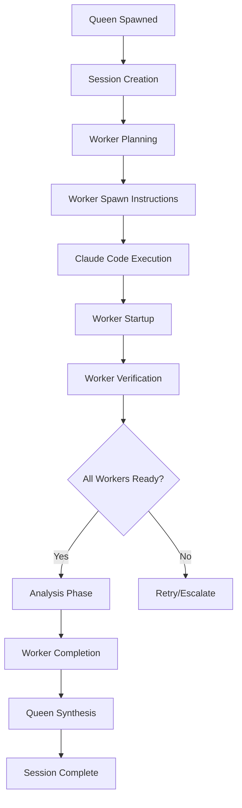

# Queen-Worker Coordination Protocol## Overview
This protocol ensures deterministic, observable coordination between Queen orchestrator and worker agents.

## Core Principles

1. **Event-Driven Coordination**: All coordination through EVENTS.jsonl
2. **State Consistency**: STATE.json as single source of truth
3. **Atomic Operations**: All file operations must be atomic
4. **Verification Loops**: Every action must be verifiable
5. **Graceful Degradation**: Handle failures without cascade

## Coordination Flow



## Queen Orchestration Protocol

### 1. Session Initialization

```python
class QueenOrchestrator:
    """Enhanced Queen with deterministic coordination"""
    
    def __init__(self):
        self.protocol_active = True
        self.session_id = None
        self.workers = {}
        self.state = {}
        
    def initialize_session(self, task_description):
        """Create session with complete scaffolding"""
        import re
        from datetime import datetime
        
        # Generate session ID
        task_slug = re.sub(r'[^a-zA-Z0-9]+', '-', task_description.lower())[:50]
        timestamp = datetime.now().strftime('%Y-%m-%d-%H-%M')
        self.session_id = f"{timestamp}-{task_slug}"
        
        # Create session structure atomically
        session_path = f"Docs/hive-mind/sessions/{self.session_id}"
        
        Bash(command=f"""
            mkdir -p '{session_path}/workers/json' \\
                     '{session_path}/workers/prompts' \\
                     '{session_path}/notes' && \\
            touch '{session_path}/EVENTS.jsonl' \\
                  '{session_path}/DEBUG.jsonl' \\
                  '{session_path}/BACKLOG.jsonl'
        """, description="Create session structure atomically")
        
        # Initialize state
        self.state = {
            "session_id": self.session_id,
            "created_at": datetime.now().isoformat(),
            "last_updated": datetime.now().isoformat(),
            "coordinator": "queen-orchestrator",
            "status": "initializing",
            "coordination_status": {
                "phase": "planning",
                "workers_spawned": [],
                "workers_completed": [],
                "workers_pending": [],
                "synthesis_ready": False
            },
            "worker_configs": {}
        }
        
        # Write initial state
        Write(
            file_path=f"{session_path}/STATE.json",
            content=json.dumps(self.state, indent=2)
        )
        
        # Log initialization
        self.log_event("queen_spawned", "Coordination analysis initiated")
        self.log_event("session_created", "Session scaffolding complete")
        
        return self.session_id
    
    def log_event(self, event_type, details, status=None):
        """Atomic event logging with verification"""
        from datetime import datetime
        import json
        
        event = {
            "timestamp": datetime.now().isoformat(),
            "type": event_type,
            "agent": "queen-orchestrator",
            "details": details
        }
        
        if status:
            event["status"] = status
            
        event_json = json.dumps(event, separators=(',', ':'))
        
        # Atomic write with verification
        result = Bash(
            command=f'printf "%s\\n" {json.dumps(event_json)} >> "Docs/hive-mind/sessions/{self.session_id}/EVENTS.jsonl" && echo "logged"',
            description=f"Log {event_type}"
        ).strip()
        
        if result != "logged":
            raise RuntimeError(f"Failed to log event: {event_type}")
            
        return event
```

### 2. Worker Planning and Configuration

```python
    def plan_workers(self, task_analysis):
        """Plan worker deployment based on task requirements"""
        
        worker_matrix = {
            "security": ["analyzer-worker"],
            "performance": ["analyzer-worker"],
            "architecture": ["architect-worker"],
            "database": ["backend-worker", "architect-worker"],
            "api": ["backend-worker"],
            "infrastructure": ["devops-worker"],
            "frontend": ["frontend-worker", "designer-worker"],
            "testing": ["test-worker"],
            "research": ["researcher-worker"]
        }
        
        # Determine required workers
        required_workers = set()
        
        for domain, workers in worker_matrix.items():
            if domain in task_analysis.lower():
                required_workers.update(workers)
        
        # Configure each worker
        worker_configs = {}
        
        for worker_type in required_workers:
            worker_configs[worker_type] = self.generate_worker_config(
                worker_type, 
                task_analysis
            )
        
        # Update state
        self.state["worker_configs"] = worker_configs
        self.state["coordination_status"]["workers_pending"] = list(required_workers)
        self.update_state()
        
        # Log planning
        self.log_event("workers_planned", f"Required workers: {', '.join(required_workers)}")
        
        return worker_configs
    
    def generate_worker_config(self, worker_type, task_context):
        """Generate worker-specific configuration"""
        
        base_config = {
            "tag_access": self.get_worker_tags(worker_type),
            "escalation_timeout": 300,
            "complexity_level": 3,
            "task_description": task_context,
            "specific_focus": self.get_worker_focus(worker_type, task_context),
            "status": "not_started",
            "protocol_compliance": {
                "startup_completed": False,
                "monitoring_active": False
            }
        }
        
        return base_config
    
    def get_worker_tags(self, worker_type):
        """Get appropriate tags for worker type"""
        tag_map = {
            "analyzer-worker": ["security", "performance"],
            "architect-worker": ["architecture", "patterns"],
            "backend-worker": ["backend", "database"],
            "frontend-worker": ["frontend", "ui"],
            "designer-worker": ["design", "ux"],
            "devops-worker": ["infrastructure", "deployment"],
            "test-worker": ["testing", "quality"],
            "researcher-worker": ["research", "patterns"]
        }
        
        return tag_map.get(worker_type, ["general"])
    
    def get_worker_focus(self, worker_type, task_context):
        """Generate worker-specific focus area"""
        focus_map = {
            "analyzer-worker": "Security vulnerabilities and performance bottlenecks",
            "architect-worker": "System design patterns and architectural compliance",
            "backend-worker": "API implementation and database optimization",
            "frontend-worker": "UI components and user experience",
            "designer-worker": "Visual design and accessibility",
            "devops-worker": "Infrastructure and deployment configuration",
            "test-worker": "Test coverage and quality assurance",
            "researcher-worker": "Best practices and industry standards"
        }
        
        return focus_map.get(worker_type, "General analysis")
```

### 3. Worker Spawn Coordination

```python
    def generate_spawn_instructions(self):
        """Generate structured spawn instructions for Claude Code"""
        
        spawn_instructions = {
            "coordination_action": "spawn_workers",
            "session_id": self.session_id,
            "protocol_version": self.protocol_version,
            "workers": []
        }
        
        for worker_type, config in self.state["worker_configs"].items():
            # Create worker prompt file
            prompt_path = f"Docs/hive-mind/sessions/{self.session_id}/workers/prompts/{worker_type}.prompt"
            
            prompt_content = f"""Session ID: {self.session_id}
Worker Type: {worker_type}
Task: {config['task_description']}
Focus: {config['specific_focus']}
Tags: {json.dumps(config['tag_access'])}
Timeout: {config['escalation_timeout']}
Protocol: enhanced-v2"""
            
            Write(file_path=prompt_path, content=prompt_content)
            
            # Add spawn instruction
            spawn_instructions["workers"].append({
                "worker_type": worker_type,
                "prompt_file": prompt_path,
                "agent_config": f".claude/agents/{worker_type}.md",
                "verification_required": True
            })
        
        # Update state
        self.state["status"] = "worker_spawn_pending"
        self.update_state()
        
        # Log spawn generation
        self.log_event("spawn_instructions_generated", 
                      f"Generated instructions for {len(spawn_instructions['workers'])} workers")
        
        return spawn_instructions
```

### 4. Worker Verification Protocol

```python
    def verify_worker_startup(self, worker_type, timeout_seconds=30):
        """Verify worker startup with timeout"""
        import time
        
        start_time = time.time()
        required_events = [
            "worker_spawned",
            "session_validated",
            "worker_configured",
            "context_loaded",
            "todo_initialized",
            "worker_ready"
        ]
        
        while time.time() - start_time < timeout_seconds:
            found_events = self.get_worker_events(worker_type)
            
            if all(event in found_events for event in required_events):
                # Worker startup complete
                self.state["coordination_status"]["workers_spawned"].append(worker_type)
                self.update_state()
                
                self.log_event("worker_verified", f"{worker_type} startup confirmed")
                return True
            
            time.sleep(2)
        
        # Timeout reached
        self.log_event("worker_verification_timeout", 
                      f"{worker_type} failed to complete startup in {timeout_seconds}s")
        return False
    
    def get_worker_events(self, worker_type):
        """Get all events for a specific worker"""
        import json
        
        events = []
        
        try:
            events_content = Read(f"Docs/hive-mind/sessions/{self.session_id}/EVENTS.jsonl")
            
            for line in events_content.strip().split('\n'):
                if not line.strip():
                    continue
                    
                try:
                    event = json.loads(line)
                    if event.get("agent") == worker_type:
                        events.append(event.get("type"))
                except:
                    continue
        except:
            pass
            
        return events
```

### 5. Analysis Monitoring

```python
    def monitor_worker_progress(self):
        """Monitor worker analysis progress"""
        
        while True:
            # Check for worker completion events
            completed = self.check_worker_completions()
            
            if completed == len(self.state["worker_configs"]):
                # All workers complete
                self.state["coordination_status"]["synthesis_ready"] = True
                self.update_state()
                
                self.log_event("all_workers_complete", 
                              "All worker analyses complete, ready for synthesis")
                break
            
            # Check for escalations
            escalations = self.check_escalations()
            if escalations:
                self.handle_escalations(escalations)
            
            # Log progress
            self.log_event("progress_check", {
                "completed": completed,
                "total": len(self.state["worker_configs"]),
                "pending": self.state["coordination_status"]["workers_pending"]
            })
            
            time.sleep(30)  # Check every 30 seconds
    
    def check_worker_completions(self):
        """Check how many workers have completed"""
        completed_workers = []
        
        for worker_type in self.state["worker_configs"]:
            json_path = f"Docs/hive-mind/sessions/{self.session_id}/workers/json/{worker_type.replace('-worker', '-response')}.json"
            
            if Bash(command=f"[ -f '{json_path}' ] && echo 'exists'", 
                   description=f"Check {worker_type} completion").strip() == "exists":
                completed_workers.append(worker_type)
        
        # Update state
        self.state["coordination_status"]["workers_completed"] = completed_workers
        pending = set(self.state["worker_configs"].keys()) - set(completed_workers)
        self.state["coordination_status"]["workers_pending"] = list(pending)
        
        return len(completed_workers)
```

### 6. Synthesis Protocol

```python
    def synthesize_results(self):
        """Synthesize all worker results into final analysis"""
        
        synthesis = {
            "session_id": self.session_id,
            "synthesis_timestamp": datetime.now().isoformat(),
            "worker_results": {},
            "aggregated_scores": {},
            "critical_findings": [],
            "recommendations": []
        }
        
        # Collect all worker JSONs
        for worker_type in self.state["coordination_status"]["workers_completed"]:
            json_path = f"Docs/hive-mind/sessions/{self.session_id}/workers/json/{worker_type.replace('-worker', '-response')}.json"
            
            try:
                worker_result = json.loads(Read(json_path))
                synthesis["worker_results"][worker_type] = worker_result
                
                # Aggregate scores
                if "scores" in worker_result:
                    for metric, score in worker_result["scores"].items():
                        if metric not in synthesis["aggregated_scores"]:
                            synthesis["aggregated_scores"][metric] = []
                        synthesis["aggregated_scores"][metric].append(score)
                
                # Collect critical findings
                if worker_result.get("summary", {}).get("critical_issues_found", 0) > 0:
                    synthesis["critical_findings"].extend(
                        worker_result.get("summary", {}).get("high_priority_recommendations", [])
                    )
                    
            except Exception as e:
                self.log_event("synthesis_error", f"Failed to read {worker_type} results: {str(e)}")
        
        # Calculate average scores
        for metric in synthesis["aggregated_scores"]:
            scores = synthesis["aggregated_scores"][metric]
            synthesis["aggregated_scores"][metric] = {
                "average": sum(scores) / len(scores),
                "min": min(scores),
                "max": max(scores),
                "count": len(scores)
            }
        
        # Generate synthesis document
        synthesis_md = self.generate_synthesis_document(synthesis)
        
        Write(
            file_path=f"Docs/hive-mind/sessions/{self.session_id}/notes/RESEARCH_SYNTHESIS.md",
            content=synthesis_md
        )
        
        # Update final state
        self.state["status"] = "completed"
        self.state["coordination_status"]["phase"] = "synthesis_complete"
        self.update_state()
        
        # Log completion
        self.log_event("synthesis_completed", "Cross-domain synthesis complete")
        self.log_event("session_completed", "Multi-agent analysis complete")
        
        return synthesis
    
    def update_state(self):
        """Update STATE.json atomically"""
        from datetime import datetime
        
        self.state["last_updated"] = datetime.now().isoformat()
        
        Write(
            file_path=f"Docs/hive-mind/sessions/{self.session_id}/STATE.json",
            content=json.dumps(self.state, indent=2)
        )
```

## Worker Communication Protocol

### Event Types

```yaml
Lifecycle Events:
  - worker_spawned: Worker successfully started
  - worker_ready: Worker completed startup
  - worker_heartbeat: Periodic health check
  - worker_completed: Analysis complete
  - worker_failed: Worker encountered fatal error

Coordination Events:
  - escalation: Issue requiring attention
  - escalation_acknowledged: Escalation received
  - escalation_resolved: Issue resolved
  
Progress Events:
  - task_progress: Percentage complete
  - analysis_phase_complete: Phase finished
  - checkpoint_reached: Milestone achieved
```

### Message Format

```json
{
  "timestamp": "ISO-8601 timestamp",
  "type": "event_type",
  "agent": "agent_name",
  "details": "string or object",
  "status": "optional status",
  "protocol_version": "2.0.0"
}
```

## Benefits

1. **Complete Observability**: Every coordination step logged
2. **Deterministic Execution**: Reproducible coordination flows
3. **Failure Recovery**: Graceful handling of worker failures
4. **Verification Loops**: Ensure workers complete successfully
5. **Atomic Operations**: Prevent race conditions
6. **Protocol Versioning**: Evolution tracking
